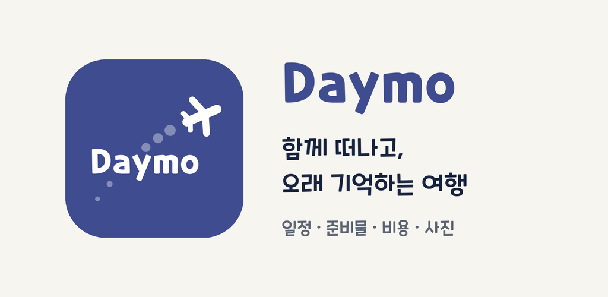
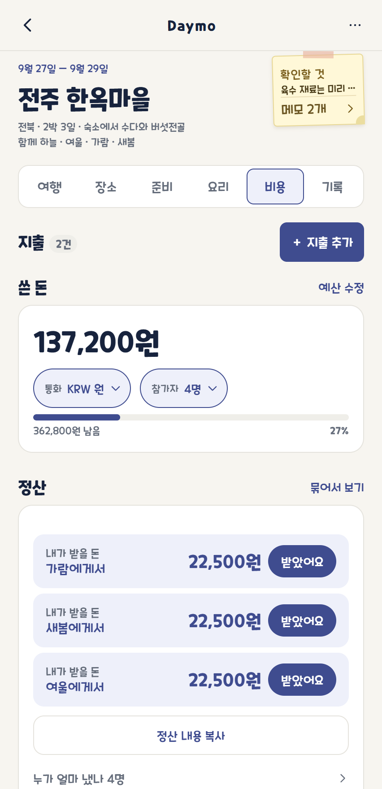

# Daymo

**함께 쓰는 여행 노트.** 연인, 친구, 가족과 한 공간에서 여행을 계획하고 준비하고 기록합니다.

여행 준비는 보통 메신저에서 시작합니다. 숙소 링크, 가 보고 싶은 가게, 챙길 것, 누가 얼마를 냈는지가 대화에 섞여 내려가다 보면 나중에는 다시 찾기가 어렵습니다. 그래서 같은 충전기를 둘이 챙겨 오고, 정작 필요한 재료는 아무도 안 챙겨 옵니다.

Daymo는 이 이야기를 여행 하나하나로 나눠 담습니다. 여행마다 일정과 장소, 준비물, 요리, 비용, 사진이 제자리에 있고, 준비물과 재료에는 챙길 사람이 붙습니다. 쓴 돈은 이번에 같이 간 사람끼리만 나눠 정산합니다. 여행이 끝나도 지우지 않고 추억으로 남습니다.

## 바로 써 보기

**https://www.daymo.xyz/app** 에서 지금 바로 쓰실 수 있습니다. 설치 없이 브라우저에서 열립니다.

아이폰에서는 Safari로 접속한 뒤 공유 버튼에서 **홈 화면에 추가**를 누르면 앱처럼 쓰실 수 있습니다.

## 화면

아래쪽에 탭이 네 개 있습니다.

<table>
  <tr>
    <td align="center"> <b>홈</b></td>
    <td align="center"> <b>여행</b></td>
    <td align="center"> <b>찾기</b></td>
    <td align="center"> <b>우리</b></td>
  </tr>
  <tr>
    <td width="25%" valign="top">다음 여행이 카드 한 장으로 보입니다. 숙소와 체크인 시각, 일정·장소·준비물 개수가 한자리에 있고, 「출발 전 확인할 것」에서 아직 남은 것을 짚어 줍니다.</td>
    <td width="25%" valign="top">여행 목록입니다. 전체·예정·추억으로 걸러 보고, 새 여행을 만들 때 이번에 함께 갈 사람을 고릅니다. 같은 목록을 지도와 캘린더로도 볼 수 있습니다. 캘린더에는 멤버들의 일정과 메모도 함께 적힙니다.</td>
    <td width="25%" valign="top">공간에 쌓인 기록을 한 칸에서 찾습니다. 장소·일정·요리·준비·기록 종류별로 결과를 좁히고, 찾은 장소를 바로 일정에 담거나 지도로 열 수 있습니다.</td>
    <td width="25%" valign="top">공간과 멤버를 봅니다. 공간을 바꾸고, 함께 쓰는 사람과 권한을 확인합니다. 아래로는 함께 쌓은 여행 통계와 앱 설정이 이어집니다.</td>
  </tr>
</table>

「여행」 탭 위쪽의 **목록 / 지도 / 캘린더** 버튼은 같은 여행 목록을 다르게 보여줍니다.

<table>
  <tr>
    <td width="210" align="center"> <b>여행 · 지도 보기</b></td>
    <td valign="top">다녀온 지역에 여행 수가 배지로 붙습니다. 두 손가락으로 벌리거나 휠을 굴려 자유롭게 확대·축소하고, 지역을 누르면 그곳의 여행만 모아 봅니다. 어디를 얼마나 다녔는지 한눈에 들어옵니다.</td>
  </tr>
</table>

여행 하나를 열면 탭이 여섯 개 나옵니다. 어느 탭에서나 위쪽에 여행 이름과 날짜, 함께 가는 사람, 그리고 같이 쓰는 노란 메모지가 보입니다.

<table>
  <tr>
    <td align="center"> <b>여행</b></td>
    <td align="center"> <b>장소</b></td>
    <td align="center"> <b>준비</b></td>
    <td align="center"> <b>요리</b></td>
    <td align="center"> <b>비용</b></td>
    <td align="center"> <b>기록</b></td>
  </tr>
  <tr>
    <td width="16%" valign="top">날짜별 일정과 가는 편·오는 편 교통편, 숙소와 예약을 적습니다. 일정 줄에서 지도 앱을 바로 엽니다.</td>
    <td width="16%" valign="top">가 볼까 하는 곳을 모아 둡니다. 지도 공유 링크를 붙여넣으면 이름과 주소가 채워지고, 마음에 들면 일정에 담습니다.</td>
    <td width="16%" valign="top">챙길 것을 적고 누가 챙길지 나눕니다. 남은 것만 골라 보거나 「집에서」처럼 묶어 접어 둘 수 있습니다.</td>
    <td width="16%" valign="top">숙소에서 해 먹을 요리와 재료를 적으면, 현지에서 살 것과 집에서 챙길 것으로 나눠 장보기 목록을 만들어 줍니다.</td>
    <td width="16%" valign="top">쓴 돈과 예산을 보고, 누가 누구에게 얼마를 보내면 되는지 「나」 기준으로 알려 줍니다.</td>
    <td width="16%" valign="top">여행 사진과 일기를 모아 둡니다. 사진과 문구를 골라 여행 기념 카드도 만듭니다.</td>
  </tr>
</table>

요리 탭은 숙소에 주방이 있는 여행에서만 나옵니다.

## 이런 것을 할 수 있습니다

| | |
| --- | --- |
| **여행 공간과 초대** | 공간을 만들고 초대 링크를 보내면 받은 분이 바로 들어옵니다. 멤버마다 관리자·편집 가능·보기만 권한을 정합니다. 연인·친구·가족 공간을 따로 두고 오갈 수 있고, 연인 공간에서는 「함께한 지 N일째」가 보입니다. |
| **일정과 장소** | 날짜별 일정, 숙소와 체크인·체크아웃, 예약, 가는 편과 오는 편 교통편을 한자리에 적습니다. 가 보고 싶은 곳은 지도 공유 링크를 붙여넣어 모아 두고, 정해지면 일정에 담습니다. |
| **준비물** | 챙길 것을 적고 누가 챙길지 나눕니다. 공용으로 두거나 담당을 정할 수 있고, 진행률로 남은 양이 보입니다. 요리 재료에서 바로 가져올 수도 있습니다. |
| **요리와 장보기** | 해 먹을 요리와 재료를 적으면 현지에서 살 것과 집에서 챙길 것으로 나눠 줍니다. 레시피 링크를 걸어 두고, 장 본 금액은 비용으로 넘깁니다. |
| **비용과 정산** | 누가 얼마를 냈는지 적으면 누가 누구에게 얼마를 보내면 되는지 계산해 줍니다. 똑같이 나누거나 일부만, 금액을 직접 적을 수도 있습니다. 보냈다고 기록하면 남은 금액이 줄고, 정산 내용을 단톡방에 붙일 수 있게 복사합니다. 예산과 외국 통화, 영수증 사진도 지원합니다. |
| **기록** | 여행 사진과 일기를 날짜별로 남겨 두고 여행이 끝난 뒤에도 꺼내 봅니다. 마음에 드는 사진을 대표 사진으로 정하고 홈에 보일 부분을 고릅니다. 사진과 문구를 골라 여행 기념 카드를 만듭니다. |
| **지도와 캘린더** | 여행 목록을 지역 지도나 캘린더로 바꿔 봅니다. 캘린더에는 여행과 함께 멤버마다 일정·메모를 적어, 누가 언제 바쁜지 한 달력에서 봅니다. |
| **검색** | 여행·일정·장소·준비물·요리·재료·메모·일기를 한 칸에서 찾습니다. 지난 여행에서 갔던 그 가게 이름이 기억나지 않을 때 쓰시면 됩니다. |

실제 송금은 앱이 하지 않습니다. 「보냈어요」는 보냈다고 적어 두는 기록이고, 계좌이체는 은행이나 송금 앱에서 하시면 됩니다.

## 로그인

이메일, 카카오, 네이버, Google로 로그인하실 수 있습니다. Apple 로그인은 준비 중입니다.

만 14세 이상만 가입하실 수 있습니다.

## 지금 상태

| | |
| --- | --- |
| 웹 | https://www.daymo.xyz/app 에서 쓰실 수 있습니다 |
| Android · iOS 앱 | 스토어 출시를 준비하고 있습니다. 아직 스토어에는 없습니다 |
| 알림 | 아직 없습니다. 다른 멤버가 고친 내용은 여행을 다시 열 때 보입니다 |

## 문의와 약관

| | |
| --- | --- |
| 소개 | https://www.daymo.xyz |
| 문의 | support@daymo.xyz |
| 개인정보 처리방침 | https://www.daymo.xyz/privacy |
| 이용약관 | https://www.daymo.xyz/terms |
| 계정 삭제 안내 | https://www.daymo.xyz/account-deletion |

---

개발 문서는 [`docs/`](docs/)에 있습니다.
