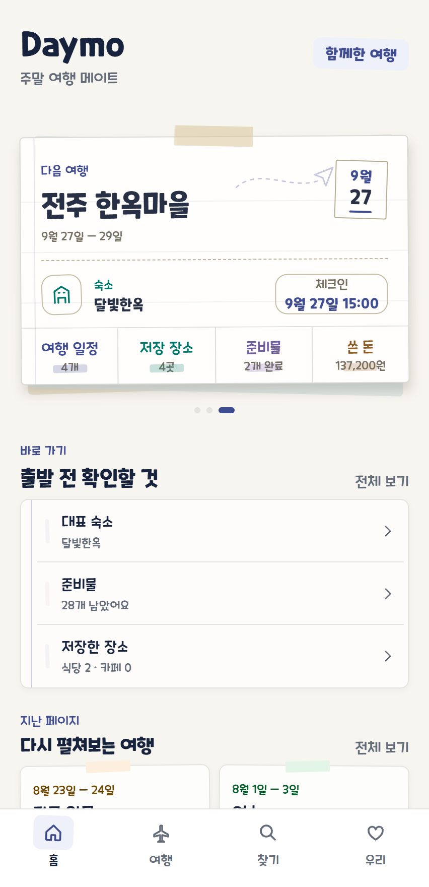
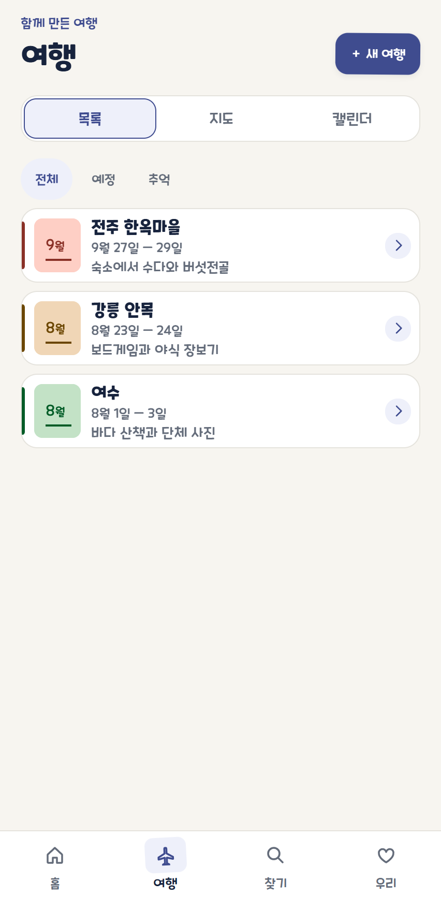
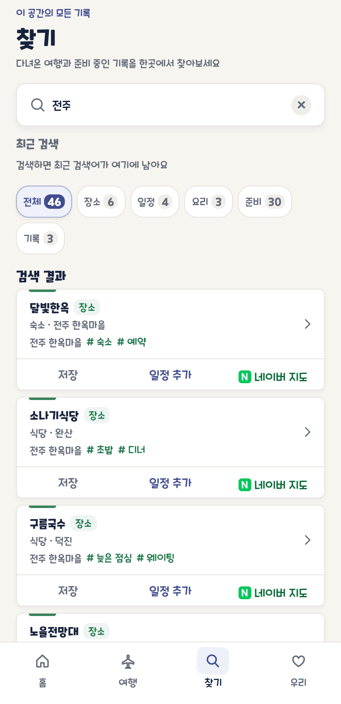
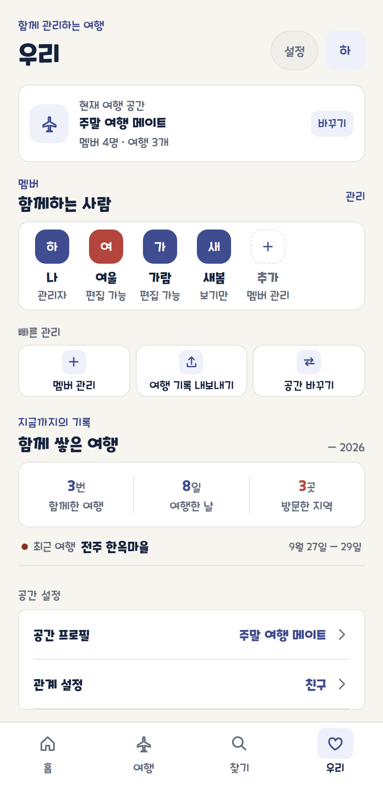
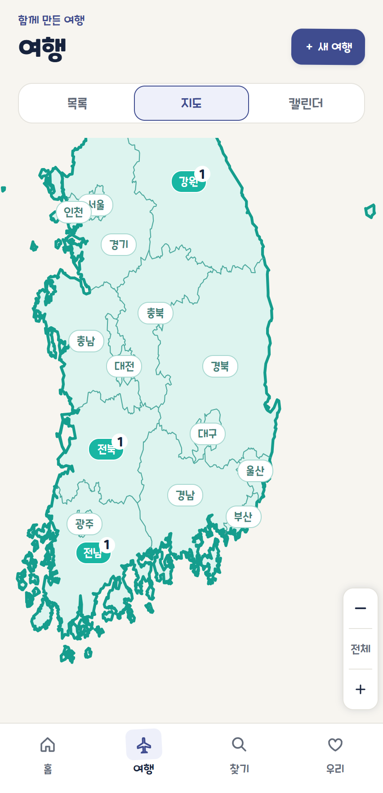
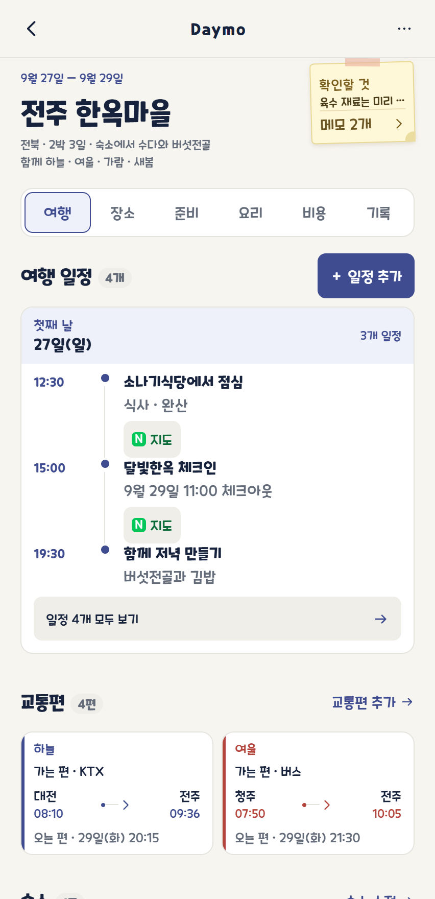
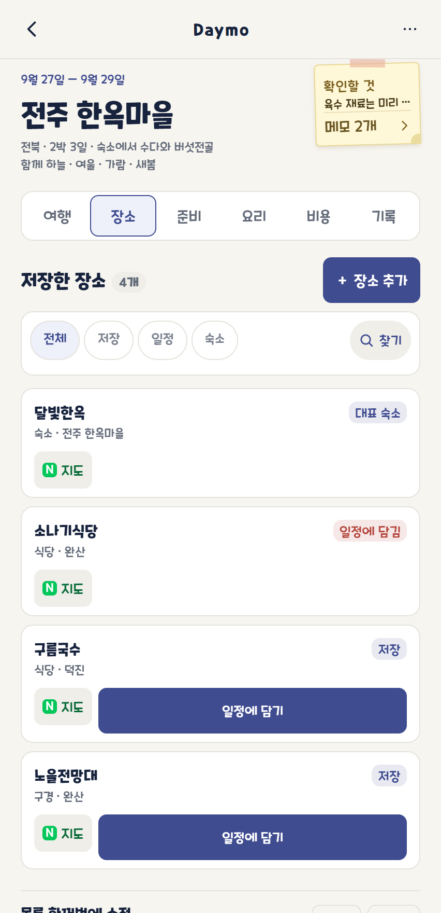
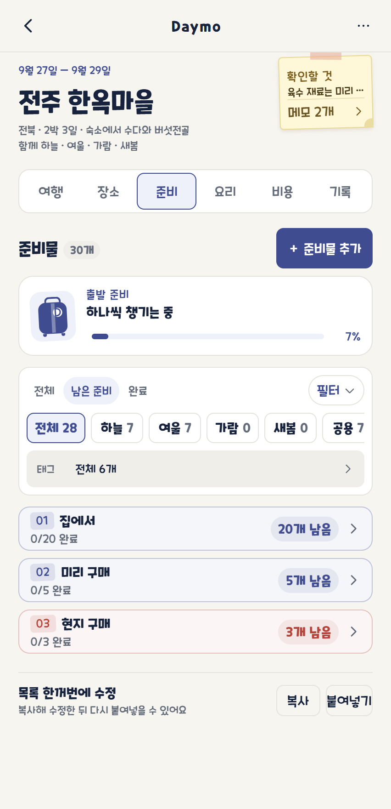
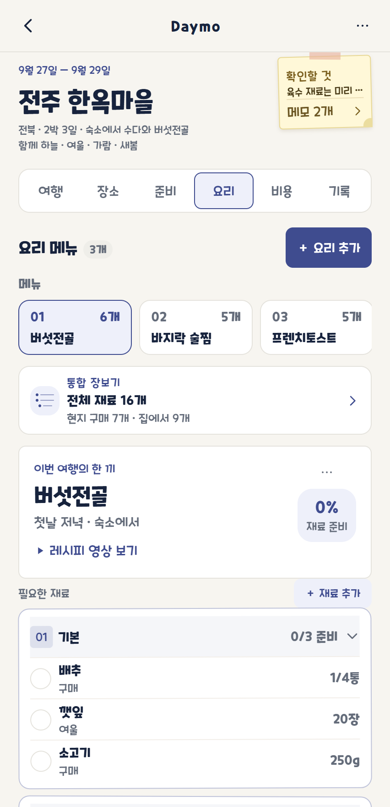
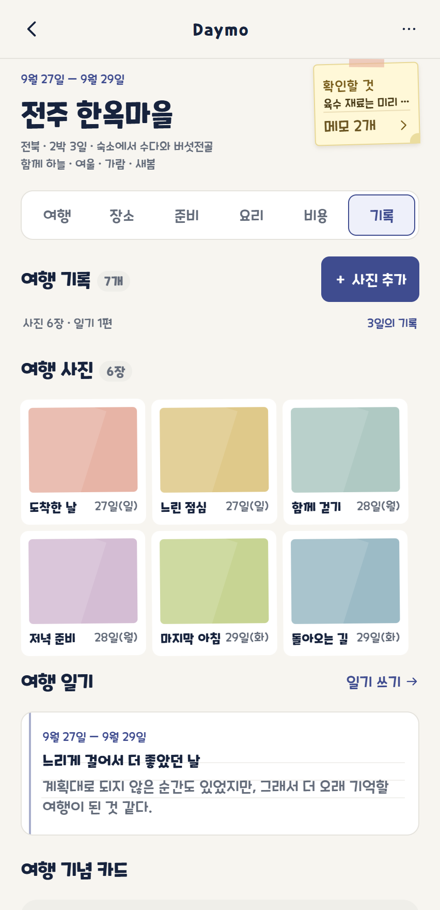

# Daymo

**우리의 여행 수첩.** 둘 이상이 함께 계획하고, 준비하고, 기록한다.

원래는 카카오톡 공지에 여행 기록을 쌓았다. 그런데 공지는 오래된 글이 아래로 내려가면 스크롤 말고는 찾을 방법이 없고, 검색이 없고, 댓글은 고칠 수 없고, 전부 한 덩어리 txt다. 숙소·일정·먹을 것·해먹을 것·재료·준비물·교통편·예약을 한 사람이 한 줄씩 적어 내려가니 **누가 무엇을 챙기는지**가 매번 흐려졌다. 같은 충전기를 둘이 챙겨 오고, 육수 재료는 아무도 안 챙겨 왔다.

Daymo는 그 한 덩어리를 **여행 단위로 쪼개서 구조로 만든다.** 여행 하나가 일정·장소·준비·요리·기록을 갖고, 준비물과 재료에는 담당이 붙고, 전체가 검색된다. 여행이 끝나도 지우지 않고 추억으로 남긴다.

연인만을 위한 앱은 아니다. 공간을 여러 개 만들어 연인·친구·가족과 각각 쓸 수 있고, 연인 공간에서만 "함께한 지 N일째"가 보인다.

> 현재는 **UI 프로토타입**이다. 서버와 인증은 아직 붙지 않았고 화면 데이터는 가명 시드다. [아직 안 된 것](#아직-안-된-것)을 먼저 보라.

## 화면

하단 탭 네 개다.

<table>
  <tr>
    <td align="center"><br><b>홈</b></td>
    <td align="center"><br><b>여행</b></td>
    <td align="center"><br><b>찾기</b></td>
    <td align="center"><br><b>우리</b></td>
  </tr>
  <tr>
    <td width="25%" valign="top">다음 여행 한 장. 숙소와 체크인 시각, 일정·저장 장소·준비물 개수가 카드 하나에 있다. 아래 「출발 전, 이것만」은 지금 해야 할 것만 추린 체크리스트고, 각 줄은 여행 첫 화면이 아니라 해당 상세 탭을 바로 연다.</td>
    <td width="25%" valign="top">여행 목록 보기. 전체·예정·추억으로 거르고, 왼쪽 색 띠와 월 배지로 여행을 구분한다. 오른쪽 위에서 새 여행을 만든다. 같은 여행을 지도와 캘린더로도 본다.</td>
    <td width="25%" valign="top">여행 전체를 한 칸에서 찾는다. 최근 검색어가 남고, 종류(장소·일정·요리·준비·기록)별 개수로 결과를 좁힌다. 결과 카드에서 일정에 담거나 네이버 지도를 바로 연다.</td>
    <td width="25%" valign="top">공간과 멤버를 관리한다. 현재 공간을 바꾸고, 멤버별 권한(관리자·편집 가능·보기만)을 보고, 초대 링크를 공유한다. 아래로는 함께 쌓은 여행 통계와 앱 설정이 이어진다.</td>
  </tr>
</table>

「여행」 탭 위쪽의 **목록 / 지도 / 캘린더** 버튼은 같은 여행 목록을 다르게 보여준다. 위 화면이 목록이고, 지도는 이렇게 생겼다.

<table>
  <tr>
    <td width="210" align="center"><br><b>여행 · 지도 보기</b></td>
    <td valign="top">
      다녀온 지역에 여행 수가 배지로 붙는다. 두 손가락으로 벌리거나 휠을 굴려 단계 없이 이어서 확대·축소하고, 오른쪽 아래 <code>＋ / − / 전체</code> 버튼으로도 움직인다. 이름표뿐 아니라 <b>육지 아무 곳이나 누르면</b> 그 지역이 골라지고, 바다를 누르면 아무 일도 일어나지 않는다. 확대하면 시군구 경계가 함께 나타난다.
    </td>
  </tr>
</table>

여행을 열면 상세 탭 다섯 개가 나온다. 다섯 화면 모두 위쪽은 같다 — 여행 이름과 날짜, 그리고 오른쪽의 노란 메모지는 둘이 같이 쓰는 여행 공동 메모다.

<table>
  <tr>
    <td align="center"><br><b>여행</b></td>
    <td align="center"><br><b>장소</b></td>
    <td align="center"><br><b>준비</b></td>
    <td align="center"><br><b>요리</b></td>
    <td align="center"><br><b>기록</b></td>
  </tr>
  <tr>
    <td width="20%" valign="top">날짜별 일정, 가는 편과 오는 편 교통편, 대표 숙소와 예약. 일정 줄의 <code>N 지도</code>를 누르면 네이버 지도가 열린다.</td>
    <td width="20%" valign="top">여행 때 갈지 말지 정할 후보 장소를 모아 둔다. 전체·저장·일정·대표 숙소로 거르고 태그로 좁힌다. 카드마다 <code>대표 숙소</code>·<code>일정에 담김</code> 상태가 붙는다.</td>
    <td width="20%" valign="top">준비물 30개와 진행률 막대. 상태(전체·남은 준비·완료)와 담당(멤버별·공용·미정, 각각 개수가 붙는다)으로 거르고, 「집에서」처럼 묶어 접는다. 줄 오른쪽 칩이 담당이다.</td>
    <td width="20%" valign="top">요리를 골라 그 재료를 보고, 통합 장보기에서 <b>현지 구매 7개 · 집에서 9개</b>로 나눠 본다. 요리마다 재료 준비율과 레시피 영상 링크가 있다.</td>
    <td width="20%" valign="top">사진·일기·기록한 날 수를 먼저 세어 보여준다. 아래로 여행 기념 카드, 여행 일기, 여행 사진이 이어진다.</td>
  </tr>
</table>

요리 탭은 숙소에 주방이 있을 때만 나온다.

## 주요 기능

실제로 코드에 있는 것만 적는다.

| 영역 | 기능 |
| --- | --- |
| 홈 | 다음 여행 카드 · 출발 전 체크리스트 · 지난 여행 다시 보기 · 연인 공간의 「함께한 지 N일째」 |
| 여행 | 목록 · 대한민국 지역 지도 · 기간이 이어져 보이는 캘린더 · 전체/예정/추억 필터 · 지역과 기간을 고르는 새 여행 만들기 |
| 여행 지도 | 지역별 여행 수 배지 · 두 손가락과 휠·트랙패드로 단계 없이 이어지는 확대·축소 · 끌어서 이동 · 이름표와 육지 아무 곳이나 눌러 지역 선택(바다는 반응 없음) · 확대하면 나타나는 시군구 경계 |
| 찾기 | 여행·일정·장소·태그·준비물·요리·재료·메모 통합 검색 · 최근 검색어 · 종류별 필터 · 결과에서 상세 탭으로 이동 |
| 우리 | 여러 공간 전환 · 멤버와 권한 · 초대 링크 공유 · 공간 프로필과 관계 설정 · 여행 통계 · 앱 색상과 화면 모드 · 도움말 · 오픈소스 라이선스 · 여행 기록 내보내기 · 로그아웃과 계정 삭제 확인 |
| 여행 탭 | 날짜별 일정 추가·수정 · 전체 보기와 접기 · 대표 숙소와 체크인/체크아웃 · 예약 · 가는 편/오는 편 교통편 · 여행 공동 메모 추가·수정·삭제 |
| 장소 탭 | 후보 장소 수집 · 종류와 태그로 거르기 · **네이버 지도 공유 텍스트를 붙여넣으면 이름·주소·링크 자동 입력** · 일정에 담기 · 대표 숙소로 등록 · 목록 한 번에 붙여넣기 |
| 준비 탭 | 공용/담당별 구분 · 전체·남은 준비·완료 필터 · 태그 · 줄 전체를 눌러 완료 · 담당 변경 · 목록 붙여넣기 · **요리 재료에서 가져오기** |
| 요리 탭 | 요리와 재료 추가·수정·삭제 · 재료 분류와 준비 방법 · 요리별 재료와 통합 장보기 목록 · 레시피/유튜브 링크 열기 · **GPT 프롬프트를 복사해 받은 결과를 붙여넣어 한 번에 추가** |
| 기록 탭 | 여행 사진 · 여행 일기 · 사진과 문구를 골라 만드는 여행 기념 카드 |
| 로그인 | 이메일 로그인·회원가입 폼(필수/선택 약관 동의 구분) · 카카오·네이버·Google·Apple 버튼 |

## 화면 구조

```text
홈        다음 여행 · 체크리스트 · 지난 여행
여행      목록 │ 지도 │ 캘린더  →  여행 상세
찾기      통합 검색
우리      공간 · 멤버 · 통계 · 설정

여행 상세  여행 │ 장소 │ 준비 │ 요리* │ 기록
                             * 주방이 있는 여행에서만
```

## 기술 스택

| | |
| --- | --- |
| 런타임 | Expo SDK 57 · React Native 0.86 · React 19.2 · TypeScript 6.0 |
| 대상 | iOS · Android, 그리고 웹(`react-native-web`) 미리보기 |
| Node | 24 LTS (`.nvmrc`, `engines: >=24 <25`) |
| 화면 | `react-native-safe-area-context` · `react-native-svg`(지도·아이콘) |
| 인증 | `expo-auth-session` · `expo-web-browser` |
| 그 외 | `expo-font` · `expo-clipboard` · `expo-status-bar` |
| 아이콘 | `mobile/scripts/build-icons.py` (Pillow로 1024px 아이콘 3종 생성) |

라우팅 라이브러리나 상태 관리 라이브러리는 아직 쓰지 않는다. 화면 전환과 데이터가 전부 `WarmAppShell.tsx`와 `WarmTripDetail.tsx`의 `useState`다.

## 실행

```bash
cd mobile
npm ci
npm run ios          # expo run:ios
npm run android      # expo run:android
npm run web          # expo start --web
npm start            # expo start
npx tsc --noEmit     # 타입 검사 (npm script는 아직 없다)
```

`npm run web`은 그냥 미리보기가 아니라 **화면 폭에 따라 다르게 그린다.** PC 브라우저(폭 700px 이상, 마우스)에서는 390×844 휴대폰 프레임 안에 상단 노치와 홈 바까지 그려 실제 기기처럼 보여주고, 휴대폰 브라우저나 좁은 창에서는 프레임 없이 꽉 채운다. 작은 화면 안에 또 작은 화면을 만들지 않기 위해서다.

앱 아이콘을 다시 만들려면 Pillow가 필요하다.

```bash
cd mobile
python scripts/build-icons.py
```

## 디자인

여행 수첩·종이·테이프의 질감을 쓰되 정보 구조를 돕는 선에서만 쓴다. 의미 없는 아이콘과 장식용 일러스트는 넣지 않는다. 자세한 기준은 [`docs/product-rules/01-daymo-development-rules.md`](docs/product-rules/01-daymo-development-rules.md) 4~5장에 있다.

**서체.** 제목과 수치는 쿠키런 Bold, 본문과 라벨은 쿠키런 Regular다. 원래는 `fontFamily`를 한 번도 지정하지 않아 한글이 OS 기본 폰트로 떨어졌고 iOS·안드로이드·웹이 서로 다르게 보였다. 쿠키런 라이선스가 임의 수정과 개작을 금지하므로 서브셋을 만들지 않고 공식 배포 TTF를 바이트 그대로 싣는다. 저작권 안내와 전문 링크는 앱 안 `우리 > 오픈소스 라이선스`에 있다.

**테마 일곱 가지.** `Daymo`(인디고) · 로즈베리 · 소프트 퍼플 · 클리어 스카이 · 그린 가든 · 세이지 피크닉 · 빈티지 노트. 각각 라이트와 다크를 모두 갖고, 화면 모드는 시스템 설정을 따르거나 직접 고를 수 있다.

**색은 눈대중이 아니라 계산해서 맞췄다.** 기준색에서는 색상각만 가져오고 밝기와 채도는 다시 계산한다. 각 강조색은 자기 모드의 배경·표면·보조 표면·soft 칩 네 가지 배경 모두에서 WCAG AA 4.5:1을 넘긴다. 보조 문구 색도 세 배경 전부에서 AA를 넘겨야 해서 한 번 갈아엎었다(이전 값 `#747D8D`는 3.57:1이었다). 장소·숙소·준비·요리·기록의 도메인 색도 명도와 채도를 역할별로 통일했다 — 요리의 주황은 흰 배경에서 AA를 통과시키느라 갈색에 가까워졌고, 이건 의도한 절충이다. 여행마다 갖는 고유 색은 배경으로 쓰는 `fill`과 글자로 쓰는 `ink`를 나눠 저장한다. 중간 밝기 하나로는 양쪽 대비를 낼 수 없기 때문이다.

토큰은 [`mobile/src/theme/`](mobile/src/theme/)에 있다. 근거와 계산 과정은 파일 주석에 남겨 뒀다.

## 아직 안 된 것

- **서버와 인증이 없다.** 화면 데이터는 전부 컴포넌트 로컬 상태이고 가명 시드다. 기기에 저장하는 것도 없어서(`AsyncStorage`·`SecureStore` 미사용) 앱을 다시 열면 초기값으로 돌아간다. 체크한 준비물도, 바꾼 테마도 남지 않는다.
- **소셜 로그인은 서버 주소가 있어야 동작한다.** `EXPO_PUBLIC_DAYMO_AUTH_URL`이 없으면 버튼이 안내 문구만 띄운다. 그 OAuth 서버는 아직 없다. 이메일 로그인은 입력값 형식만 확인하고 통과시킨다. 앱은 시드 사용자로 이미 로그인된 상태에서 시작하므로 로그인 화면은 로그아웃해야 볼 수 있다.
- **사진은 자리만 잡아 뒀다.** 「기기에서 사진 선택」을 눌러도 실제 사진첩이 열리지 않고 미리보기 색만 바뀐다. 이미지 선택 라이브러리를 아직 넣지 않았다.
- **백엔드가 문서에만 있다.** Java 21 + Spring Boot 3.x, PostgreSQL, ConoHa VPS로 설계돼 있지만 프로젝트 자체가 없다.
- **여행 보관과 삭제 복구가 없다.** 문서에는 보관함과 7일 복구가 정의돼 있으나 화면에는 없다.
- **지도의 지역 선택은 어림이다.** 육지인지 아닌지는 정확히 판정하지만, 시도별 영역 데이터가 없어서 누른 자리에서 **가장 가까운 중심점**의 시도를 고른다. 시도가 대체로 둥글어 대부분 맞지만 경기도처럼 다른 시를 감싸는 모양에서는 어긋날 수 있다(`mobile/src/koreaHitTest.ts`).
- **카카오 지도 링크가 없다.** 요구사항에는 네이버와 카카오가 함께 있지만 코드에는 네이버 지도만 연결돼 있다.
- **자동 검사가 없다.** `tsc`를 손으로 돌리는 것이 전부다. lint·test·CI와 `typecheck`/`lint`/`test` npm script가 아직 없다.

## 문서

| | |
| --- | --- |
| [`docs/01-requirements.md`](docs/01-requirements.md) | 요구사항 원문. 왜 만드는지, 무엇이 불편했는지 |
| [`docs/02-raw-travel-data.md`](docs/02-raw-travel-data.md) | 실제 사용 예시. 데이터 구조를 검증하는 기준 |
| [`docs/03-implementation-plan.md`](docs/03-implementation-plan.md) | 구현 계획 요약. 현재 상태, 목표, 개발 순서 |
| [`docs/development/`](docs/development/README.md) | 개발 기준 문서 11편. 환경, 데이터 모델, API 명세, 로드맵, 품질, VPS 운영, 로컬 우선 동기화, 개인정보·출시, UI 추적표, 착수 준비, 소유자 안내 |
| [`docs/product-rules/`](docs/product-rules/README.md) | 제품 규칙. 탭별 규칙과 재사용 가능한 앱 개발 규칙 |
