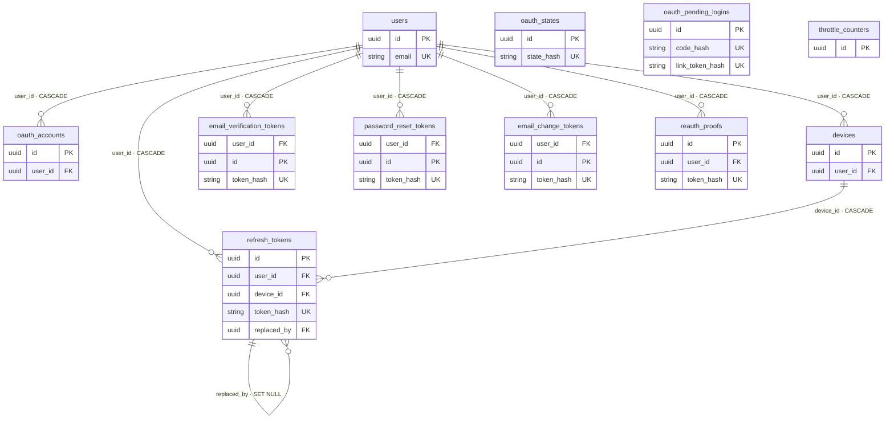
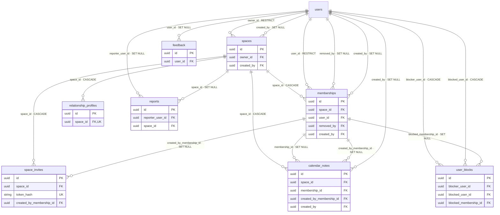
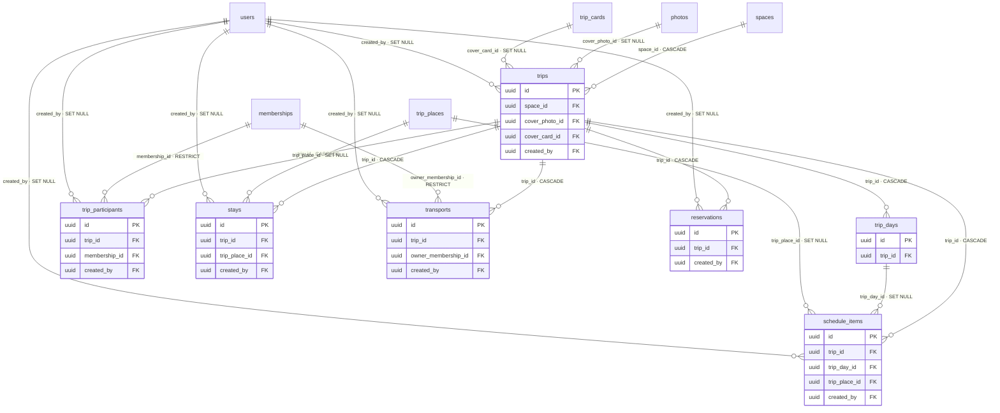
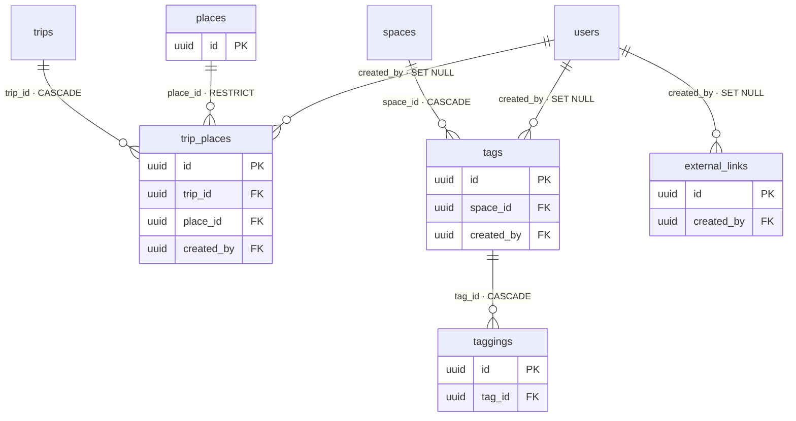
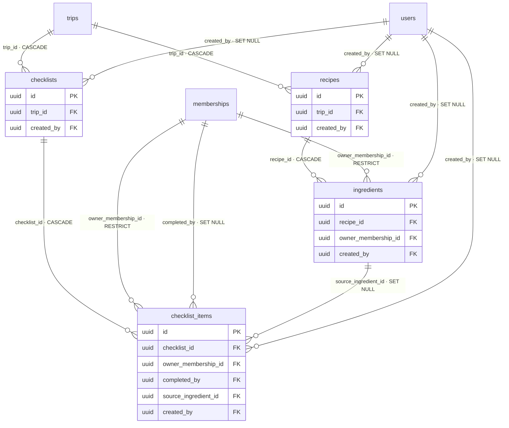
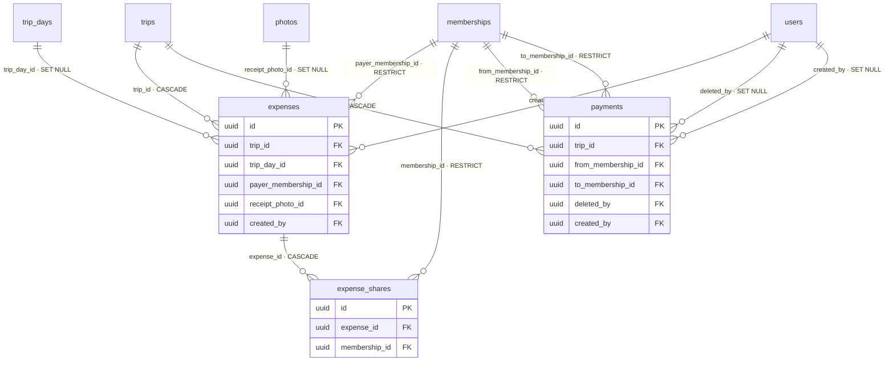
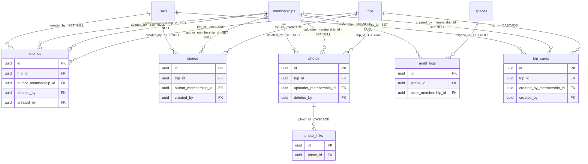

# 현재 운영 DB ERD와 키·인덱스 명세

> 기준 시각: 2026-09-26 (Asia/Seoul)  
> 기준 DB: 운영 PostgreSQL 16.10, Alembic `d3a8f1c6b2e4`  
> 확인 방법: 운영 DB의 `pg_dump --schema-only`와 `backend/app/models` 메타데이터를 비교했다. 실제 사용자 행과 값은 조회하지 않았다.

> **시각화 자료:** [브라우저용 ERD 탐색 화면](./erd/index.html) · [전체 개요 SVG](./erd/daymo-erd-overview.svg) · [전체 컬럼 PDF](./erd/daymo-erd-full.pdf) · [사용 안내](./erd/README.md)

## 한눈에 보기

| 항목 | 수 |
| --- | ---: |
| 업무 테이블 | 44 |
| 컬럼 | 475 |
| 기본키(PK) | 44 |
| 외래키(FK) | 95 |
| CHECK 제약 | 66 |
| UNIQUE 제약 | 3 |
| 별도 인덱스 | 74 |
| 그중 UNIQUE 인덱스 | 22 |

- 모든 업무 테이블의 PK는 단일 `uuid id`다. UUID는 애플리케이션에서 생성한다.
- PostgreSQL은 FK 열에 인덱스를 자동 생성하지 않는다. 이 문서의 인덱스 목록은 실제로 생성된 것만 적었다.
- `created_by` 계열은 작성자 계정이 지워져도 본문을 남기기 위해 대부분 `ON DELETE SET NULL`이다.
- 여행·공간의 소유 관계는 `CASCADE`, 정산 당사자와 담당자처럼 함부로 지우면 안 되는 관계는 `RESTRICT`가 중심이다.

## 운영 DB와 모델의 차이

1. 운영 DB에는 `ix_photos_original_expiry (original_expires_at) WHERE original_path IS NOT NULL`가 있으나 SQLAlchemy 모델에는 선언이 없다. 마이그레이션에는 있으므로 서비스 동작에는 문제가 없지만, 자동 스키마 비교에서는 삭제 대상으로 잘못 잡힐 수 있다.
2. `trips.cover_card_id → trip_cards.id` FK 이름이 운영 DB는 `fk_trips_cover_card_id`, 모델 규칙은 `fk_trips_cover_card_id_trip_cards`다. 동작과 삭제 정책(`SET NULL`)은 같다.
3. 테이블·컬럼·제약의 기능 차이는 발견되지 않았다. 운영 DB의 44개 테이블은 모델의 44개와 일치한다.

## 관계도

관계선의 끝에는 FK 열과 부모 삭제 시 동작을 적었다. `CASCADE`는 부모 삭제 시 자식도 삭제, `SET NULL`은 참조만 비움, `RESTRICT`는 참조 중이면 부모 삭제를 막는다는 뜻이다.

### 계정·인증



### 공간·권한·운영



### 여행·일정



### 장소·태그·링크



### 준비·요리



### 비용·정산



### 기록·사진·옛 카드



## DB가 강제하지 않는 논리 관계

아래는 `target_type + target_id` 형태라 하나의 FK로 표현할 수 없다. 삭제·권한·같은 공간/여행 여부는 서비스 코드가 검증한다.

| 테이블 | 논리 참조 | 실제 보조 인덱스 |
| --- | --- | --- |
| `external_links` | `trip`, `place`, `schedule`, `stay` | `(target_type, target_id)` |
| `taggings` | scope에 따른 장소·준비물·재료 | `(target_type, target_id)`, UNIQUE `(tag_id, target_type, target_id)` |
| `photo_links` | `trip`, `day`, `place`, `schedule`, `stay` | `(target_type, target_id)`, UNIQUE `(photo_id, target_type, target_id)` |
| `reservations` | 예약 대상 종류와 대상 UUID | `(target_type, target_id)` |
| `reports` | 신고 대상 종류와 대상 UUID | 없음(운영 조회는 `status, created_at`) |
| `audit_logs` | 감사 대상 종류와 대상 UUID | `(target_type, target_id)` |

또한 DB는 두 FK가 같은 상위 범위에 속하는지까지는 보장하지 않는다. 예를 들어 `schedule_items.trip_id`와 `trip_day_id`가 같은 여행인지, `expenses.trip_id`와 `payer_membership_id`가 같은 공간인지, `trip_participants.membership_id`가 해당 여행의 공간 멤버인지 여부는 API 서비스 계층이 검사한다.

## 인덱스 분석과 권고

### 우선 보강할 것

1. **활성 멤버를 사용자 기준으로 찾는 부분 인덱스**

   거의 모든 권한 검사와 공간 목록 조회가 `memberships.user_id = ? AND left_at IS NULL`을 사용한다. 현재 UNIQUE 부분 인덱스는 `(space_id, user_id) WHERE left_at IS NULL`라 `user_id` 단독 조건에는 효율적으로 쓰이지 않는다.

   ```sql
   CREATE INDEX CONCURRENTLY ix_memberships_user_active
     ON memberships (user_id, space_id)
     WHERE left_at IS NULL;
   ```

2. **기기별 활성 refresh token 인덱스**

   로그아웃·기기 세션 종료가 `refresh_tokens.device_id`로 갱신한다. 현재 이 열을 선두로 하는 인덱스가 없다.

   ```sql
   CREATE INDEX CONCURRENTLY ix_refresh_tokens_device_alive
     ON refresh_tokens (device_id)
     WHERE revoked_at IS NULL;
   ```

### 모델에 다시 선언할 것

운영 DB에 이미 있는 아래 인덱스를 `Photo.__table_args__`에도 선언해야 한다. 새 인덱스를 만드는 작업이 아니라 모델과 운영 스키마의 차이를 없애는 작업이다.

```sql
CREATE INDEX ix_photos_original_expiry
  ON photos (original_expires_at)
  WHERE original_path IS NOT NULL;
```

### 지금은 추가하지 않을 것

- `created_by`, `deleted_by`, `author_membership_id` 같은 감사·표시용 FK마다 인덱스를 일괄 추가하지 않는다. 현재 조회는 여행·공간 인덱스로 먼저 범위를 좁히며, 인덱스가 늘면 쓰기 비용과 저장 공간만 증가한다.
- 통합 검색의 `ILIKE` 열마다 trigram 인덱스를 바로 만들지 않는다. 지금 규모에서는 테이블별 `trip_id`/`space_id` 범위를 먼저 좁힌다. 검색 지연과 `EXPLAIN (ANALYZE, BUFFERS)`가 필요성을 보여 줄 때 GIN/trigram 또는 검색 전용 구조를 선택한다.
- 모든 FK에 기계적으로 인덱스를 만들지 않는다. 물리 삭제가 드문 `RESTRICT`/`SET NULL` 관계는 실제 쿼리와 삭제 빈도를 보고 추가한다.

## 전체 테이블 명세

표기: `NN`은 NOT NULL, `PK`는 기본키, `FK`는 외래키다. 기본값은 DB 기본값만 표시한다. UUID의 애플리케이션 기본값은 표에 반복하지 않는다.

### 계정·인증

#### `users`

| 컬럼 | 타입 | NULL | 키·참조 | DB 기본값 |
| --- | --- | --- | --- | --- |
| `id` | `uuid` | NN | PK | `` |
| `email` | `varchar(320)` | NN | UNIQUE | `` |
| `email_verified_at` | `timestamptz` | 허용 | - | `` |
| `password_hash` | `varchar(255)` | 허용 | - | `` |
| `display_name` | `varchar(50)` | NN | - | `` |
| `terms_version` | `varchar(20)` | 허용 | - | `` |
| `terms_agreed_at` | `timestamptz` | 허용 | - | `` |
| `avatar_path` | `varchar(500)` | 허용 | - | `` |
| `timezone` | `varchar(64)` | NN | - | `` |
| `status` | `varchar(20)` | NN | - | `` |
| `deletion_requested_at` | `timestamptz` | 허용 | - | `` |
| `deletion_scheduled_at` | `timestamptz` | 허용 | - | `` |
| `deleted_at` | `timestamptz` | 허용 | - | `` |
| `created_at` | `timestamptz` | NN | - | `now()` |
| `updated_at` | `timestamptz` | NN | - | `now()` |

**제약**

- `uq_users_email`: UNIQUE (`email`)
- `ck_users_userstatus`: CHECK `((status)::text = ANY ((ARRAY['active'::character varying, 'suspended'::character varying, 'deleted'::character varying])::text[]))`

**인덱스**

- `ix_users_deletion_due`: BTREE (`deletion_scheduled_at`) WHERE `deletion_scheduled_at IS NOT NULL`

#### `oauth_accounts`

| 컬럼 | 타입 | NULL | 키·참조 | DB 기본값 |
| --- | --- | --- | --- | --- |
| `id` | `uuid` | NN | PK | `` |
| `user_id` | `uuid` | NN | FK → `users.id` (CASCADE) | `` |
| `provider` | `varchar(20)` | NN | - | `` |
| `provider_subject` | `varchar(255)` | NN | - | `` |
| `provider_email` | `varchar(320)` | 허용 | - | `` |
| `created_at` | `timestamptz` | NN | - | `now()` |
| `updated_at` | `timestamptz` | NN | - | `now()` |

**제약**

- `ck_oauth_accounts_oauthprovider`: CHECK `((provider)::text = ANY ((ARRAY['google'::character varying, 'apple'::character varying, 'kakao'::character varying, 'naver'::character varying])::text[]))`

**인덱스**

- `ix_oauth_accounts_user`: BTREE (`user_id`)
- `uq_oauth_accounts_subject`: UNIQUE BTREE (`provider, provider_subject`)

#### `oauth_states`

| 컬럼 | 타입 | NULL | 키·참조 | DB 기본값 |
| --- | --- | --- | --- | --- |
| `id` | `uuid` | NN | PK | `` |
| `provider` | `varchar(20)` | NN | - | `` |
| `state_hash` | `varchar(64)` | NN | - | `` |
| `nonce` | `varchar(64)` | NN | - | `` |
| `app_redirect_uri` | `varchar(200)` | NN | - | `` |
| `app_state` | `varchar(128)` | NN | - | `` |
| `code_challenge` | `varchar(128)` | NN | - | `` |
| `expires_at` | `timestamptz` | NN | - | `` |
| `used_at` | `timestamptz` | 허용 | - | `` |
| `created_at` | `timestamptz` | NN | - | `now()` |
| `updated_at` | `timestamptz` | NN | - | `now()` |

**제약**

- `ck_oauth_states_oauthprovider`: CHECK `((provider)::text = ANY ((ARRAY['google'::character varying, 'apple'::character varying, 'kakao'::character varying, 'naver'::character varying])::text[]))`

**인덱스**

- `ix_oauth_states_expires`: BTREE (`expires_at`)
- `uq_oauth_states_hash`: UNIQUE BTREE (`state_hash`)

#### `oauth_pending_logins`

| 컬럼 | 타입 | NULL | 키·참조 | DB 기본값 |
| --- | --- | --- | --- | --- |
| `id` | `uuid` | NN | PK | `` |
| `provider` | `varchar(20)` | NN | - | `` |
| `provider_subject` | `varchar(255)` | NN | - | `` |
| `provider_email` | `varchar(320)` | 허용 | - | `` |
| `email_verified` | `boolean` | NN | - | `` |
| `display_name` | `varchar(50)` | 허용 | - | `` |
| `code_hash` | `varchar(64)` | NN | - | `` |
| `code_challenge` | `varchar(128)` | NN | - | `` |
| `expires_at` | `timestamptz` | NN | - | `` |
| `used_at` | `timestamptz` | 허용 | - | `` |
| `link_token_hash` | `varchar(64)` | 허용 | - | `` |
| `link_expires_at` | `timestamptz` | 허용 | - | `` |
| `linked_at` | `timestamptz` | 허용 | - | `` |
| `created_at` | `timestamptz` | NN | - | `now()` |
| `updated_at` | `timestamptz` | NN | - | `now()` |

**제약**

- `ck_oauth_pending_logins_oauthprovider`: CHECK `((provider)::text = ANY ((ARRAY['google'::character varying, 'apple'::character varying, 'kakao'::character varying, 'naver'::character varying])::text[]))`

**인덱스**

- `ix_oauth_pending_logins_expires`: BTREE (`expires_at`)
- `uq_oauth_pending_logins_code`: UNIQUE BTREE (`code_hash`)
- `uq_oauth_pending_logins_link`: UNIQUE BTREE (`link_token_hash`) WHERE `link_token_hash IS NOT NULL`

#### `devices`

| 컬럼 | 타입 | NULL | 키·참조 | DB 기본값 |
| --- | --- | --- | --- | --- |
| `id` | `uuid` | NN | PK | `` |
| `user_id` | `uuid` | NN | FK → `users.id` (CASCADE) | `` |
| `installation_id` | `varchar(64)` | NN | - | `` |
| `platform` | `varchar(20)` | NN | - | `` |
| `app_version` | `varchar(20)` | 허용 | - | `` |
| `display_name` | `varchar(40)` | 허용 | - | `` |
| `last_seen_at` | `timestamptz` | NN | - | `now()` |
| `revoked_at` | `timestamptz` | 허용 | - | `` |
| `created_at` | `timestamptz` | NN | - | `now()` |
| `updated_at` | `timestamptz` | NN | - | `now()` |

**제약**

- `ck_devices_deviceplatform`: CHECK `((platform)::text = ANY ((ARRAY['ios'::character varying, 'android'::character varying, 'web'::character varying, 'unknown'::character varying])::text[]))`

**인덱스**

- `ix_devices_user_seen`: BTREE (`user_id, last_seen_at`)
- `uq_devices_installation`: UNIQUE BTREE (`user_id, installation_id`)

#### `refresh_tokens`

| 컬럼 | 타입 | NULL | 키·참조 | DB 기본값 |
| --- | --- | --- | --- | --- |
| `id` | `uuid` | NN | PK | `` |
| `user_id` | `uuid` | NN | FK → `users.id` (CASCADE) | `` |
| `device_id` | `uuid` | 허용 | FK → `devices.id` (CASCADE) | `` |
| `token_family_id` | `uuid` | NN | - | `` |
| `token_hash` | `varchar(64)` | NN | - | `` |
| `last_used_at` | `timestamptz` | 허용 | - | `` |
| `expires_at` | `timestamptz` | NN | - | `` |
| `replaced_by` | `uuid` | 허용 | FK → `refresh_tokens.id` (SET NULL) | `` |
| `revoked_at` | `timestamptz` | 허용 | - | `` |
| `revoke_reason` | `varchar(20)` | 허용 | - | `` |
| `created_at` | `timestamptz` | NN | - | `now()` |
| `updated_at` | `timestamptz` | NN | - | `now()` |

**제약**

- `ck_refresh_tokens_revokereason`: CHECK `((revoke_reason)::text = ANY ((ARRAY['rotated'::character varying, 'reuse_detected'::character varying, 'logout'::character varying, 'password_reset'::character varying, 'device_limit'::character varying, 'admin'::character varying, 'account_deletion'::character varying, 'password_change'::character varying])::text[]))`

**인덱스**

- `ix_refresh_tokens_family`: BTREE (`token_family_id`)
- `ix_refresh_tokens_user_alive`: BTREE (`user_id, revoked_at`)
- `uq_refresh_tokens_hash`: UNIQUE BTREE (`token_hash`)

#### `email_verification_tokens`

| 컬럼 | 타입 | NULL | 키·참조 | DB 기본값 |
| --- | --- | --- | --- | --- |
| `user_id` | `uuid` | NN | FK → `users.id` (CASCADE) | `` |
| `id` | `uuid` | NN | PK | `` |
| `token_hash` | `varchar(64)` | NN | - | `` |
| `expires_at` | `timestamptz` | NN | - | `` |
| `used_at` | `timestamptz` | 허용 | - | `` |
| `revoked_at` | `timestamptz` | 허용 | - | `` |
| `created_at` | `timestamptz` | NN | - | `now()` |
| `updated_at` | `timestamptz` | NN | - | `now()` |

**제약**

- PK·FK 외 별도 제약 없음

**인덱스**

- `ix_email_verification_tokens_user`: BTREE (`user_id`)
- `uq_email_verification_tokens_hash`: UNIQUE BTREE (`token_hash`)

#### `password_reset_tokens`

| 컬럼 | 타입 | NULL | 키·참조 | DB 기본값 |
| --- | --- | --- | --- | --- |
| `user_id` | `uuid` | NN | FK → `users.id` (CASCADE) | `` |
| `id` | `uuid` | NN | PK | `` |
| `token_hash` | `varchar(64)` | NN | - | `` |
| `expires_at` | `timestamptz` | NN | - | `` |
| `used_at` | `timestamptz` | 허용 | - | `` |
| `revoked_at` | `timestamptz` | 허용 | - | `` |
| `created_at` | `timestamptz` | NN | - | `now()` |
| `updated_at` | `timestamptz` | NN | - | `now()` |

**제약**

- PK·FK 외 별도 제약 없음

**인덱스**

- `ix_password_reset_tokens_user`: BTREE (`user_id`)
- `uq_password_reset_tokens_hash`: UNIQUE BTREE (`token_hash`)

#### `email_change_tokens`

| 컬럼 | 타입 | NULL | 키·참조 | DB 기본값 |
| --- | --- | --- | --- | --- |
| `user_id` | `uuid` | NN | FK → `users.id` (CASCADE) | `` |
| `new_email` | `varchar(320)` | NN | - | `` |
| `id` | `uuid` | NN | PK | `` |
| `token_hash` | `varchar(64)` | NN | - | `` |
| `expires_at` | `timestamptz` | NN | - | `` |
| `used_at` | `timestamptz` | 허용 | - | `` |
| `revoked_at` | `timestamptz` | 허용 | - | `` |
| `created_at` | `timestamptz` | NN | - | `now()` |
| `updated_at` | `timestamptz` | NN | - | `now()` |

**제약**

- PK·FK 외 별도 제약 없음

**인덱스**

- `ix_email_change_tokens_user`: BTREE (`user_id`)
- `uq_email_change_tokens_hash`: UNIQUE BTREE (`token_hash`)

#### `reauth_proofs`

| 컬럼 | 타입 | NULL | 키·참조 | DB 기본값 |
| --- | --- | --- | --- | --- |
| `id` | `uuid` | NN | PK | `` |
| `user_id` | `uuid` | NN | FK → `users.id` (CASCADE) | `` |
| `action` | `varchar(20)` | NN | - | `` |
| `nonce` | `varchar(64)` | NN | - | `` |
| `token_hash` | `varchar(64)` | NN | - | `` |
| `expires_at` | `timestamptz` | NN | - | `` |
| `used_at` | `timestamptz` | 허용 | - | `` |
| `created_at` | `timestamptz` | NN | - | `now()` |
| `updated_at` | `timestamptz` | NN | - | `now()` |

**제약**

- `ck_reauth_proofs_sensitiveaction`: CHECK `((action)::text = ANY ((ARRAY['delete_account'::character varying, 'cancel_deletion'::character varying, 'change_email'::character varying, 'change_password'::character varying, 'link_provider'::character varying, 'unlink_provider'::character varying])::text[]))`

**인덱스**

- `ix_reauth_proofs_user`: BTREE (`user_id, action`)
- `uq_reauth_proofs_hash`: UNIQUE BTREE (`token_hash`)

#### `throttle_counters`

| 컬럼 | 타입 | NULL | 키·참조 | DB 기본값 |
| --- | --- | --- | --- | --- |
| `id` | `uuid` | NN | PK | `` |
| `scope` | `varchar(20)` | NN | - | `` |
| `key_hash` | `varchar(64)` | NN | - | `` |
| `attempts` | `integer` | NN | - | `` |
| `window_started_at` | `timestamptz` | NN | - | `now()` |
| `last_attempt_at` | `timestamptz` | 허용 | - | `` |
| `blocked_until` | `timestamptz` | 허용 | - | `` |

**제약**

- `ck_throttle_counters_attempts_not_negative`: CHECK `(attempts >= 0)`
- `ck_throttle_counters_throttlescope`: CHECK `((scope)::text = ANY ((ARRAY['login'::character varying, 'reauth'::character varying, 'signup'::character varying, 'email_verification'::character varying, 'password_reset'::character varying, 'email_change'::character varying])::text[]))`

**인덱스**

- `ix_throttle_window`: BTREE (`window_started_at`)
- `uq_throttle_scope_key`: UNIQUE BTREE (`scope, key_hash`)

### 공간·권한·운영

#### `spaces`

| 컬럼 | 타입 | NULL | 키·참조 | DB 기본값 |
| --- | --- | --- | --- | --- |
| `id` | `uuid` | NN | PK | `` |
| `name` | `varchar(40)` | NN | - | `` |
| `relationship_type` | `varchar(20)` | NN | - | `` |
| `owner_id` | `uuid` | NN | FK → `users.id` (RESTRICT) | `` |
| `timezone` | `varchar(64)` | NN | - | `` |
| `deletion_requested_at` | `timestamptz` | 허용 | - | `` |
| `deletion_scheduled_at` | `timestamptz` | 허용 | - | `` |
| `deleted_at` | `timestamptz` | 허용 | - | `` |
| `created_at` | `timestamptz` | NN | - | `now()` |
| `updated_at` | `timestamptz` | NN | - | `now()` |
| `created_by` | `uuid` | 허용 | FK → `users.id` (SET NULL) | `` |

**제약**

- `ck_spaces_relationshiptype`: CHECK `((relationship_type)::text = ANY ((ARRAY['couple'::character varying, 'friends'::character varying, 'family'::character varying, 'other'::character varying])::text[]))`

**인덱스**

- PK/UNIQUE 제약이 만드는 인덱스 외 별도 인덱스 없음

#### `memberships`

| 컬럼 | 타입 | NULL | 키·참조 | DB 기본값 |
| --- | --- | --- | --- | --- |
| `id` | `uuid` | NN | PK | `` |
| `space_id` | `uuid` | NN | FK → `spaces.id` (CASCADE) | `` |
| `user_id` | `uuid` | NN | FK → `users.id` (RESTRICT) | `` |
| `role` | `varchar(20)` | NN | - | `` |
| `nickname` | `varchar(20)` | 허용 | - | `` |
| `joined_at` | `timestamptz` | NN | - | `now()` |
| `left_at` | `timestamptz` | 허용 | - | `` |
| `removed_by` | `uuid` | 허용 | FK → `users.id` (SET NULL) | `` |
| `created_at` | `timestamptz` | NN | - | `now()` |
| `updated_at` | `timestamptz` | NN | - | `now()` |
| `created_by` | `uuid` | 허용 | FK → `users.id` (SET NULL) | `` |

**제약**

- `ck_memberships_membershiprole`: CHECK `((role)::text = ANY ((ARRAY['owner'::character varying, 'editor'::character varying, 'viewer'::character varying])::text[]))`

**인덱스**

- `ix_memberships_space_active`: BTREE (`space_id, left_at`)
- `uq_memberships_active`: UNIQUE BTREE (`space_id, user_id`) WHERE `left_at IS NULL`

#### `relationship_profiles`

| 컬럼 | 타입 | NULL | 키·참조 | DB 기본값 |
| --- | --- | --- | --- | --- |
| `id` | `uuid` | NN | PK | `` |
| `space_id` | `uuid` | NN | FK → `spaces.id` (CASCADE) | `` |
| `started_on` | `date` | 허용 | - | `` |
| `created_at` | `timestamptz` | NN | - | `now()` |
| `updated_at` | `timestamptz` | NN | - | `now()` |

**제약**

- `uq_relationship_profiles_space`: UNIQUE (`space_id`)

**인덱스**

- PK/UNIQUE 제약이 만드는 인덱스 외 별도 인덱스 없음

#### `space_invites`

| 컬럼 | 타입 | NULL | 키·참조 | DB 기본값 |
| --- | --- | --- | --- | --- |
| `id` | `uuid` | NN | PK | `` |
| `space_id` | `uuid` | NN | FK → `spaces.id` (CASCADE) | `` |
| `token_hash` | `varchar(64)` | NN | UNIQUE | `` |
| `created_by_membership_id` | `uuid` | 허용 | FK → `memberships.id` (SET NULL) | `` |
| `expires_at` | `timestamptz` | NN | - | `` |
| `max_uses` | `integer` | NN | - | `` |
| `used_count` | `integer` | NN | - | `0` |
| `revoked_at` | `timestamptz` | 허용 | - | `` |
| `created_at` | `timestamptz` | NN | - | `now()` |
| `updated_at` | `timestamptz` | NN | - | `now()` |

**제약**

- `uq_space_invites_token_hash`: UNIQUE (`token_hash`)
- `ck_space_invites_uses_within_limit`: CHECK `((used_count >= 0) AND (used_count <= max_uses))`

**인덱스**

- `ix_space_invites_space`: BTREE (`space_id, revoked_at`)

#### `calendar_notes`

| 컬럼 | 타입 | NULL | 키·참조 | DB 기본값 |
| --- | --- | --- | --- | --- |
| `id` | `uuid` | NN | PK | `` |
| `space_id` | `uuid` | NN | FK → `spaces.id` (CASCADE) | `` |
| `kind` | `varchar(20)` | NN | - | `` |
| `membership_id` | `uuid` | 허용 | FK → `memberships.id` (SET NULL) | `` |
| `title` | `varchar(60)` | NN | - | `` |
| `start_date` | `date` | NN | - | `` |
| `end_date` | `date` | NN | - | `` |
| `time` | `time` | 허용 | - | `` |
| `created_by_membership_id` | `uuid` | 허용 | FK → `memberships.id` (SET NULL) | `` |
| `version` | `integer` | NN | - | `1` |
| `created_at` | `timestamptz` | NN | - | `now()` |
| `updated_at` | `timestamptz` | NN | - | `now()` |
| `created_by` | `uuid` | 허용 | FK → `users.id` (SET NULL) | `` |

**제약**

- `ck_calendar_notes_calendarnotekind`: CHECK `((kind)::text = ANY ((ARRAY['schedule'::character varying, 'memo'::character varying])::text[]))`
- `ck_calendar_notes_dates_in_order`: CHECK `(end_date >= start_date)`
- `ck_calendar_notes_memo_has_no_member`: CHECK `(((kind)::text <> 'memo'::text) OR (membership_id IS NULL))`
- `ck_calendar_notes_title_length`: CHECK `((char_length((title)::text) >= 1) AND (char_length((title)::text) <= 60))`

**인덱스**

- `ix_calendar_notes_space_start`: BTREE (`space_id, start_date`)

#### `feedback`

| 컬럼 | 타입 | NULL | 키·참조 | DB 기본값 |
| --- | --- | --- | --- | --- |
| `id` | `uuid` | NN | PK | `` |
| `user_id` | `uuid` | 허용 | FK → `users.id` (SET NULL) | `` |
| `kind` | `varchar(16)` | NN | - | `` |
| `body` | `text` | NN | - | `` |
| `platform` | `varchar(16)` | NN | - | `` |
| `app_version` | `varchar(32)` | NN | - | `` |
| `created_at` | `timestamptz` | NN | - | `now()` |

**제약**

- `ck_feedback_body_length`: CHECK `((char_length(body) >= 1) AND (char_length(body) <= 2000))`
- `ck_feedback_kind_known`: CHECK `((kind)::text = ANY ((ARRAY['problem'::character varying, 'idea'::character varying, 'other'::character varying])::text[]))`

**인덱스**

- `ix_feedback_time`: BTREE (`created_at`)
- `ix_feedback_user_time`: BTREE (`user_id, created_at`)

#### `reports`

| 컬럼 | 타입 | NULL | 키·참조 | DB 기본값 |
| --- | --- | --- | --- | --- |
| `id` | `uuid` | NN | PK | `` |
| `reporter_user_id` | `uuid` | 허용 | FK → `users.id` (SET NULL) | `` |
| `space_id` | `uuid` | 허용 | FK → `spaces.id` (SET NULL) | `` |
| `target_type` | `varchar(20)` | NN | - | `` |
| `target_id` | `uuid` | 허용 | - | `` |
| `reason` | `varchar(20)` | NN | - | `` |
| `detail` | `text` | 허용 | - | `` |
| `status` | `varchar(20)` | NN | - | `` |
| `created_at` | `timestamptz` | NN | - | `now()` |
| `resolved_at` | `timestamptz` | 허용 | - | `` |

**제약**

- `ck_reports_detail_length`: CHECK `((detail IS NULL) OR (char_length(detail) <= 1000))`
- `ck_reports_reportreason`: CHECK `((reason)::text = ANY ((ARRAY['spam'::character varying, 'harassment'::character varying, 'sexual'::character varying, 'violence'::character varying, 'privacy'::character varying, 'copyright'::character varying, 'other'::character varying])::text[]))`
- `ck_reports_reportstatus`: CHECK `((status)::text = ANY ((ARRAY['open'::character varying, 'resolved'::character varying])::text[]))`
- `ck_reports_reporttargettype`: CHECK `((target_type)::text = ANY ((ARRAY['memo'::character varying, 'diary'::character varying, 'photo'::character varying, 'member'::character varying, 'trip'::character varying, 'other'::character varying])::text[]))`

**인덱스**

- `ix_reports_reporter_time`: BTREE (`reporter_user_id, created_at`)
- `ix_reports_status_time`: BTREE (`status, created_at`)

#### `user_blocks`

| 컬럼 | 타입 | NULL | 키·참조 | DB 기본값 |
| --- | --- | --- | --- | --- |
| `id` | `uuid` | NN | PK | `` |
| `blocker_user_id` | `uuid` | NN | FK → `users.id` (CASCADE) | `` |
| `blocked_user_id` | `uuid` | NN | FK → `users.id` (CASCADE) | `` |
| `blocked_membership_id` | `uuid` | 허용 | FK → `memberships.id` (SET NULL) | `` |
| `created_at` | `timestamptz` | NN | - | `now()` |

**제약**

- `ck_user_blocks_not_self`: CHECK `(blocker_user_id <> blocked_user_id)`

**인덱스**

- `ix_user_blocks_blocked`: BTREE (`blocked_user_id`)
- `uq_user_blocks_pair`: UNIQUE BTREE (`blocker_user_id, blocked_user_id`)

### 여행·일정

#### `trips`

| 컬럼 | 타입 | NULL | 키·참조 | DB 기본값 |
| --- | --- | --- | --- | --- |
| `id` | `uuid` | NN | PK | `` |
| `space_id` | `uuid` | NN | FK → `spaces.id` (CASCADE) | `` |
| `title` | `varchar(60)` | NN | - | `` |
| `region_code` | `varchar(20)` | 허용 | - | `` |
| `region_name` | `varchar(40)` | 허용 | - | `` |
| `start_date` | `date` | NN | - | `` |
| `end_date` | `date` | NN | - | `` |
| `status` | `varchar(20)` | NN | - | `` |
| `summary` | `text` | 허용 | - | `` |
| `cooking_enabled` | `boolean` | NN | - | `` |
| `currency_code` | `varchar(3)` | NN | - | `` |
| `exchange_rate` | `numeric(18, 6)` | 허용 | - | `` |
| `budget` | `numeric(14, 2)` | 허용 | - | `` |
| `simplify_settlement` | `boolean` | NN | - | `` |
| `version` | `integer` | NN | - | `` |
| `cover_photo_id` | `uuid` | 허용 | FK → `photos.id` (SET NULL) | `` |
| `cover_card_id` | `uuid` | 허용 | FK → `trip_cards.id` (SET NULL) | `` |
| `cover_focus_x` | `FLOAT` | NN | - | `0.5` |
| `cover_focus_y` | `FLOAT` | NN | - | `0.5` |
| `cover_zoom` | `FLOAT` | NN | - | `1.0` |
| `archived_at` | `timestamptz` | 허용 | - | `` |
| `deleted_at` | `timestamptz` | 허용 | - | `` |
| `deletion_scheduled_at` | `timestamptz` | 허용 | - | `` |
| `created_at` | `timestamptz` | NN | - | `now()` |
| `updated_at` | `timestamptz` | NN | - | `now()` |
| `created_by` | `uuid` | 허용 | FK → `users.id` (SET NULL) | `` |

**제약**

- `ck_trips_budget_not_negative`: CHECK `((budget IS NULL) OR (budget >= (0)::numeric))`
- `ck_trips_dates_in_order`: CHECK `(end_date >= start_date)`
- `ck_trips_exchange_rate_positive`: CHECK `((exchange_rate IS NULL) OR (exchange_rate > (0)::numeric))`
- `ck_trips_tripstatus`: CHECK `((status)::text = ANY ((ARRAY['planning'::character varying, 'ongoing'::character varying, 'completed'::character varying, 'archived'::character varying])::text[]))`

**인덱스**

- `ix_trips_space_start_date`: BTREE (`space_id, start_date`)

#### `trip_days`

| 컬럼 | 타입 | NULL | 키·참조 | DB 기본값 |
| --- | --- | --- | --- | --- |
| `id` | `uuid` | NN | PK | `` |
| `trip_id` | `uuid` | NN | FK → `trips.id` (CASCADE) | `` |
| `date` | `date` | NN | - | `` |
| `day_index` | `integer` | NN | - | `` |
| `created_at` | `timestamptz` | NN | - | `now()` |
| `updated_at` | `timestamptz` | NN | - | `now()` |

**제약**

- `ck_trip_days_day_index_positive`: CHECK `(day_index >= 1)`

**인덱스**

- `uq_trip_days_date`: UNIQUE BTREE (`trip_id, date`)
- `uq_trip_days_index`: UNIQUE BTREE (`trip_id, day_index`)

#### `trip_participants`

| 컬럼 | 타입 | NULL | 키·참조 | DB 기본값 |
| --- | --- | --- | --- | --- |
| `id` | `uuid` | NN | PK | `` |
| `trip_id` | `uuid` | NN | FK → `trips.id` (CASCADE) | `` |
| `membership_id` | `uuid` | NN | FK → `memberships.id` (RESTRICT) | `` |
| `sort_order` | `integer` | NN | - | `` |
| `removed_at` | `timestamptz` | 허용 | - | `` |
| `created_at` | `timestamptz` | NN | - | `now()` |
| `updated_at` | `timestamptz` | NN | - | `now()` |
| `created_by` | `uuid` | 허용 | FK → `users.id` (SET NULL) | `` |

**제약**

- PK·FK 외 별도 제약 없음

**인덱스**

- `uq_trip_participants_active`: UNIQUE BTREE (`trip_id, membership_id`) WHERE `removed_at IS NULL`

#### `schedule_items`

| 컬럼 | 타입 | NULL | 키·참조 | DB 기본값 |
| --- | --- | --- | --- | --- |
| `id` | `uuid` | NN | PK | `` |
| `trip_id` | `uuid` | NN | FK → `trips.id` (CASCADE) | `` |
| `trip_day_id` | `uuid` | 허용 | FK → `trip_days.id` (SET NULL) | `` |
| `trip_place_id` | `uuid` | 허용 | FK → `trip_places.id` (SET NULL) | `` |
| `start_at` | `timestamptz` | 허용 | - | `` |
| `end_at` | `timestamptz` | 허용 | - | `` |
| `title` | `varchar(60)` | NN | - | `` |
| `type` | `varchar(20)` | NN | - | `` |
| `note` | `text` | 허용 | - | `` |
| `sort_order` | `integer` | NN | - | `` |
| `version` | `integer` | NN | - | `1` |
| `created_at` | `timestamptz` | NN | - | `now()` |
| `updated_at` | `timestamptz` | NN | - | `now()` |
| `created_by` | `uuid` | 허용 | FK → `users.id` (SET NULL) | `` |

**제약**

- `ck_schedule_items_scheduleitemtype`: CHECK `((type)::text = ANY ((ARRAY['place'::character varying, 'meal'::character varying, 'move'::character varying, 'rest'::character varying, 'other'::character varying])::text[]))`
- `ck_schedule_items_times_in_order`: CHECK `((end_at IS NULL) OR (start_at IS NULL) OR (end_at >= start_at))`

**인덱스**

- `ix_schedule_items_day`: BTREE (`trip_day_id, sort_order`)
- `ix_schedule_items_trip_id`: BTREE (`trip_id`)

#### `stays`

| 컬럼 | 타입 | NULL | 키·참조 | DB 기본값 |
| --- | --- | --- | --- | --- |
| `id` | `uuid` | NN | PK | `` |
| `trip_id` | `uuid` | NN | FK → `trips.id` (CASCADE) | `` |
| `trip_place_id` | `uuid` | 허용 | FK → `trip_places.id` (SET NULL) | `` |
| `check_in_at` | `timestamptz` | 허용 | - | `` |
| `check_out_at` | `timestamptz` | 허용 | - | `` |
| `has_kitchen` | `boolean` | 허용 | - | `` |
| `booking_url` | `varchar(2048)` | 허용 | - | `` |
| `note` | `text` | 허용 | - | `` |
| `show_in_schedule` | `boolean` | NN | - | `` |
| `version` | `integer` | NN | - | `1` |
| `created_at` | `timestamptz` | NN | - | `now()` |
| `updated_at` | `timestamptz` | NN | - | `now()` |
| `created_by` | `uuid` | 허용 | FK → `users.id` (SET NULL) | `` |

**제약**

- `ck_stays_checkout_after_checkin`: CHECK `((check_out_at IS NULL) OR (check_in_at IS NULL) OR (check_out_at > check_in_at))`

**인덱스**

- `ix_stays_trip`: BTREE (`trip_id, check_in_at`)

#### `transports`

| 컬럼 | 타입 | NULL | 키·참조 | DB 기본값 |
| --- | --- | --- | --- | --- |
| `id` | `uuid` | NN | PK | `` |
| `trip_id` | `uuid` | NN | FK → `trips.id` (CASCADE) | `` |
| `owner_membership_id` | `uuid` | 허용 | FK → `memberships.id` (RESTRICT) | `` |
| `direction` | `varchar(20)` | NN | - | `` |
| `method` | `varchar(20)` | NN | - | `` |
| `travel_on` | `date` | 허용 | - | `` |
| `departure_name` | `varchar(40)` | 허용 | - | `` |
| `departure_at` | `timestamptz` | 허용 | - | `` |
| `arrival_name` | `varchar(40)` | 허용 | - | `` |
| `arrival_at` | `timestamptz` | 허용 | - | `` |
| `stops` | `jsonb` | NN | - | ``[]`::jsonb` |
| `booking_status` | `varchar(20)` | NN | - | `` |
| `note` | `text` | 허용 | - | `` |
| `show_in_schedule` | `boolean` | NN | - | `` |
| `version` | `integer` | NN | - | `1` |
| `created_at` | `timestamptz` | NN | - | `now()` |
| `updated_at` | `timestamptz` | NN | - | `now()` |
| `created_by` | `uuid` | 허용 | FK → `users.id` (SET NULL) | `` |

**제약**

- `ck_transports_arrival_after_departure`: CHECK `((arrival_at IS NULL) OR (departure_at IS NULL) OR (arrival_at >= departure_at))`
- `ck_transports_bookingstatus`: CHECK `((booking_status)::text = ANY ((ARRAY['booked'::character varying, 'not_booked'::character varying])::text[]))`
- `ck_transports_transportdirection`: CHECK `((direction)::text = ANY ((ARRAY['outbound'::character varying, 'return'::character varying])::text[]))`
- `ck_transports_transportmethod`: CHECK `((method)::text = ANY ((ARRAY['ktx'::character varying, 'srt'::character varying, 'mugunghwa'::character varying, 'express_bus'::character varying, 'intercity_bus'::character varying, 'bus'::character varying, 'flight'::character varying, 'other'::character varying])::text[]))`

**인덱스**

- `ix_transports_trip`: BTREE (`trip_id, departure_at`)

#### `reservations`

| 컬럼 | 타입 | NULL | 키·참조 | DB 기본값 |
| --- | --- | --- | --- | --- |
| `id` | `uuid` | NN | PK | `` |
| `trip_id` | `uuid` | NN | FK → `trips.id` (CASCADE) | `` |
| `target_type` | `varchar(20)` | NN | - | `` |
| `target_id` | `uuid` | 허용 | - | `` |
| `title` | `varchar(60)` | NN | - | `` |
| `party_size` | `integer` | 허용 | - | `` |
| `party_label` | `varchar(20)` | 허용 | - | `` |
| `reserved_on` | `date` | 허용 | - | `` |
| `reserved_at` | `timestamptz` | 허용 | - | `` |
| `status` | `varchar(20)` | NN | - | `` |
| `booking_url` | `varchar(2048)` | 허용 | - | `` |
| `note` | `text` | 허용 | - | `` |
| `show_in_schedule` | `boolean` | NN | - | `` |
| `version` | `integer` | NN | - | `1` |
| `created_at` | `timestamptz` | NN | - | `now()` |
| `updated_at` | `timestamptz` | NN | - | `now()` |
| `created_by` | `uuid` | 허용 | FK → `users.id` (SET NULL) | `` |

**제약**

- `ck_reservations_party_size_positive`: CHECK `((party_size IS NULL) OR (party_size > 0))`
- `ck_reservations_reservationstatus`: CHECK `((status)::text = ANY ((ARRAY['confirmed'::character varying, 'needs_check'::character varying, 'cancelled'::character varying])::text[]))`
- `ck_reservations_reservationtargettype`: CHECK `((target_type)::text = ANY ((ARRAY['place'::character varying, 'stay'::character varying, 'other'::character varying])::text[]))`

**인덱스**

- `ix_reservations_target`: BTREE (`target_type, target_id`)
- `ix_reservations_trip`: BTREE (`trip_id, reserved_at`)

### 장소·태그·링크

#### `places`

| 컬럼 | 타입 | NULL | 키·참조 | DB 기본값 |
| --- | --- | --- | --- | --- |
| `id` | `uuid` | NN | PK | `` |
| `name` | `varchar(100)` | NN | - | `` |
| `address` | `varchar(300)` | 허용 | - | `` |
| `latitude` | `numeric(8, 6)` | 허용 | - | `` |
| `longitude` | `numeric(9, 6)` | 허용 | - | `` |
| `provider` | `varchar(20)` | NN | - | `` |
| `provider_place_id` | `varchar(100)` | 허용 | - | `` |
| `created_at` | `timestamptz` | NN | - | `now()` |
| `updated_at` | `timestamptz` | NN | - | `now()` |

**제약**

- `ck_places_coordinates_together`: CHECK `((latitude IS NULL) = (longitude IS NULL))`
- `ck_places_latitude_in_range`: CHECK `((latitude IS NULL) OR ((latitude >= ('-90'::integer)::numeric) AND (latitude <= (90)::numeric)))`
- `ck_places_longitude_in_range`: CHECK `((longitude IS NULL) OR ((longitude >= ('-180'::integer)::numeric) AND (longitude <= (180)::numeric)))`
- `ck_places_placeprovider`: CHECK `((provider)::text = ANY ((ARRAY['naver'::character varying, 'kakao'::character varying, 'manual'::character varying])::text[]))`

**인덱스**

- `uq_places_provider_place`: UNIQUE BTREE (`provider, provider_place_id`) WHERE `provider_place_id IS NOT NULL`

#### `trip_places`

| 컬럼 | 타입 | NULL | 키·참조 | DB 기본값 |
| --- | --- | --- | --- | --- |
| `id` | `uuid` | NN | PK | `` |
| `trip_id` | `uuid` | NN | FK → `trips.id` (CASCADE) | `` |
| `place_id` | `uuid` | NN | FK → `places.id` (RESTRICT) | `` |
| `category` | `varchar(30)` | 허용 | - | `` |
| `status` | `varchar(20)` | NN | - | `` |
| `area` | `varchar(30)` | 허용 | - | `` |
| `memo` | `text` | 허용 | - | `` |
| `version` | `integer` | NN | - | `1` |
| `created_at` | `timestamptz` | NN | - | `now()` |
| `updated_at` | `timestamptz` | NN | - | `now()` |
| `created_by` | `uuid` | 허용 | FK → `users.id` (SET NULL) | `` |

**제약**

- `ck_trip_places_tripplacestatus`: CHECK `((status)::text = ANY ((ARRAY['saved'::character varying, 'scheduled'::character varying, 'visited'::character varying])::text[]))`

**인덱스**

- `ix_trip_places_place_id`: BTREE (`place_id`)
- `ix_trip_places_trip_status`: BTREE (`trip_id, status`)
- `uq_trip_places_place`: UNIQUE BTREE (`trip_id, place_id`)

#### `tags`

| 컬럼 | 타입 | NULL | 키·참조 | DB 기본값 |
| --- | --- | --- | --- | --- |
| `id` | `uuid` | NN | PK | `` |
| `space_id` | `uuid` | NN | FK → `spaces.id` (CASCADE) | `` |
| `scope` | `varchar(20)` | NN | - | `` |
| `name` | `varchar(20)` | NN | - | `` |
| `color` | `varchar(20)` | 허용 | - | `` |
| `created_at` | `timestamptz` | NN | - | `now()` |
| `updated_at` | `timestamptz` | NN | - | `now()` |
| `created_by` | `uuid` | 허용 | FK → `users.id` (SET NULL) | `` |

**제약**

- `ck_tags_tagscope`: CHECK `((scope)::text = ANY ((ARRAY['place'::character varying, 'packing'::character varying, 'ingredient'::character varying])::text[]))`

**인덱스**

- `uq_tags_space_scope_name`: UNIQUE BTREE (`space_id, scope, name`)

#### `taggings`

| 컬럼 | 타입 | NULL | 키·참조 | DB 기본값 |
| --- | --- | --- | --- | --- |
| `id` | `uuid` | NN | PK | `` |
| `tag_id` | `uuid` | NN | FK → `tags.id` (CASCADE) | `` |
| `target_type` | `varchar(20)` | NN | - | `` |
| `target_id` | `uuid` | NN | - | `` |
| `created_at` | `timestamptz` | NN | - | `now()` |
| `updated_at` | `timestamptz` | NN | - | `now()` |

**제약**

- `ck_taggings_tagscope`: CHECK `((target_type)::text = ANY ((ARRAY['place'::character varying, 'packing'::character varying, 'ingredient'::character varying])::text[]))`

**인덱스**

- `ix_taggings_target`: BTREE (`target_type, target_id`)
- `uq_taggings_target`: UNIQUE BTREE (`tag_id, target_type, target_id`)

#### `external_links`

| 컬럼 | 타입 | NULL | 키·참조 | DB 기본값 |
| --- | --- | --- | --- | --- |
| `id` | `uuid` | NN | PK | `` |
| `target_type` | `varchar(20)` | NN | - | `` |
| `target_id` | `uuid` | NN | - | `` |
| `provider` | `varchar(20)` | NN | - | `` |
| `url` | `varchar(2048)` | NN | - | `` |
| `label` | `varchar(40)` | 허용 | - | `` |
| `created_at` | `timestamptz` | NN | - | `now()` |
| `updated_at` | `timestamptz` | NN | - | `now()` |
| `created_by` | `uuid` | 허용 | FK → `users.id` (SET NULL) | `` |

**제약**

- `ck_external_links_linkprovider`: CHECK `((provider)::text = ANY ((ARRAY['naver_map'::character varying, 'kakao_map'::character varying, 'youtube'::character varying, 'booking'::character varying, 'other'::character varying])::text[]))`
- `ck_external_links_linktargettype`: CHECK `((target_type)::text = ANY ((ARRAY['trip'::character varying, 'place'::character varying, 'schedule'::character varying, 'stay'::character varying])::text[]))`

**인덱스**

- `ix_external_links_target`: BTREE (`target_type, target_id`)

### 준비·요리

#### `checklists`

| 컬럼 | 타입 | NULL | 키·참조 | DB 기본값 |
| --- | --- | --- | --- | --- |
| `id` | `uuid` | NN | PK | `` |
| `trip_id` | `uuid` | NN | FK → `trips.id` (CASCADE) | `` |
| `title` | `varchar(40)` | NN | - | `` |
| `kind` | `varchar(20)` | NN | - | `` |
| `created_at` | `timestamptz` | NN | - | `now()` |
| `updated_at` | `timestamptz` | NN | - | `now()` |
| `created_by` | `uuid` | 허용 | FK → `users.id` (SET NULL) | `` |

**제약**

- `ck_checklists_checklistkind`: CHECK `((kind)::text = ANY ((ARRAY['packing'::character varying, 'shopping'::character varying])::text[]))`

**인덱스**

- `ix_checklists_trip`: BTREE (`trip_id, kind`)

#### `checklist_items`

| 컬럼 | 타입 | NULL | 키·참조 | DB 기본값 |
| --- | --- | --- | --- | --- |
| `id` | `uuid` | NN | PK | `` |
| `checklist_id` | `uuid` | NN | FK → `checklists.id` (CASCADE) | `` |
| `name` | `varchar(60)` | NN | - | `` |
| `quantity` | `varchar(60)` | 허용 | - | `` |
| `owner_membership_id` | `uuid` | 허용 | FK → `memberships.id` (RESTRICT) | `` |
| `is_shared` | `boolean` | NN | - | `` |
| `completed_at` | `timestamptz` | 허용 | - | `` |
| `completed_by` | `uuid` | 허용 | FK → `memberships.id` (SET NULL) | `` |
| `source_ingredient_id` | `uuid` | 허용 | FK → `ingredients.id` (SET NULL) | `` |
| `sort_order` | `integer` | NN | - | `` |
| `version` | `integer` | NN | - | `1` |
| `created_at` | `timestamptz` | NN | - | `now()` |
| `updated_at` | `timestamptz` | NN | - | `now()` |
| `created_by` | `uuid` | 허용 | FK → `users.id` (SET NULL) | `` |

**제약**

- `ck_checklist_items_completed_by_needs_time`: CHECK `((completed_at IS NOT NULL) OR (completed_by IS NULL))`
- `ck_checklist_items_shared_has_no_owner`: CHECK `((NOT is_shared) OR (owner_membership_id IS NULL))`

**인덱스**

- `ix_checklist_items_list`: BTREE (`checklist_id, sort_order`)
- `ix_checklist_items_source_ingredient_id`: BTREE (`source_ingredient_id`)

#### `recipes`

| 컬럼 | 타입 | NULL | 키·참조 | DB 기본값 |
| --- | --- | --- | --- | --- |
| `id` | `uuid` | NN | PK | `` |
| `trip_id` | `uuid` | NN | FK → `trips.id` (CASCADE) | `` |
| `name` | `varchar(60)` | NN | - | `` |
| `memo` | `text` | 허용 | - | `` |
| `source_url` | `varchar(2048)` | 허용 | - | `` |
| `servings` | `integer` | 허용 | - | `` |
| `sort_order` | `integer` | NN | - | `` |
| `version` | `integer` | NN | - | `1` |
| `created_at` | `timestamptz` | NN | - | `now()` |
| `updated_at` | `timestamptz` | NN | - | `now()` |
| `created_by` | `uuid` | 허용 | FK → `users.id` (SET NULL) | `` |

**제약**

- `ck_recipes_servings_positive`: CHECK `((servings IS NULL) OR (servings > 0))`

**인덱스**

- `ix_recipes_trip`: BTREE (`trip_id, sort_order`)

#### `ingredients`

| 컬럼 | 타입 | NULL | 키·참조 | DB 기본값 |
| --- | --- | --- | --- | --- |
| `id` | `uuid` | NN | PK | `` |
| `recipe_id` | `uuid` | NN | FK → `recipes.id` (CASCADE) | `` |
| `name` | `varchar(60)` | NN | - | `` |
| `quantity` | `varchar(60)` | 허용 | - | `` |
| `category` | `varchar(30)` | 허용 | - | `` |
| `procurement` | `varchar(20)` | NN | - | `` |
| `owner_membership_id` | `uuid` | 허용 | FK → `memberships.id` (RESTRICT) | `` |
| `completed_at` | `timestamptz` | 허용 | - | `` |
| `sort_order` | `integer` | NN | - | `` |
| `created_at` | `timestamptz` | NN | - | `now()` |
| `updated_at` | `timestamptz` | NN | - | `now()` |
| `created_by` | `uuid` | 허용 | FK → `users.id` (SET NULL) | `` |

**제약**

- `ck_ingredients_owner_only_when_bringing`: CHECK `(((procurement)::text = 'bring'::text) OR (owner_membership_id IS NULL))`
- `ck_ingredients_procurement`: CHECK `((procurement)::text = ANY ((ARRAY['bring'::character varying, 'buy'::character varying, 'undecided'::character varying])::text[]))`

**인덱스**

- `ix_ingredients_recipe`: BTREE (`recipe_id, sort_order`)

### 비용·정산

#### `expenses`

| 컬럼 | 타입 | NULL | 키·참조 | DB 기본값 |
| --- | --- | --- | --- | --- |
| `id` | `uuid` | NN | PK | `` |
| `trip_id` | `uuid` | NN | FK → `trips.id` (CASCADE) | `` |
| `trip_day_id` | `uuid` | 허용 | FK → `trip_days.id` (SET NULL) | `` |
| `title` | `varchar(60)` | NN | - | `` |
| `amount` | `numeric(14, 2)` | NN | - | `` |
| `category` | `varchar(20)` | NN | - | `` |
| `payer_membership_id` | `uuid` | NN | FK → `memberships.id` (RESTRICT) | `` |
| `split_mode` | `varchar(20)` | 허용 | - | `` |
| `memo` | `text` | 허용 | - | `` |
| `receipt_photo_id` | `uuid` | 허용 | FK → `photos.id` (SET NULL) | `` |
| `excluded` | `boolean` | NN | - | `false` |
| `transport_id` | `uuid` | 허용 | - | `` |
| `version` | `integer` | NN | - | `1` |
| `created_at` | `timestamptz` | NN | - | `now()` |
| `updated_at` | `timestamptz` | NN | - | `now()` |
| `created_by` | `uuid` | 허용 | FK → `users.id` (SET NULL) | `` |

**제약**

- `ck_expenses_amount_positive`: CHECK `(amount > (0)::numeric)`
- `ck_expenses_expensecategory`: CHECK `((category)::text = ANY ((ARRAY['meal'::character varying, 'transport'::character varying, 'lodging'::character varying, 'admission'::character varying, 'shopping'::character varying, 'other'::character varying])::text[]))`
- `ck_expenses_splitmode`: CHECK `((split_mode)::text = ANY ((ARRAY['even'::character varying, 'subset'::character varying, 'amount'::character varying])::text[]))`

**인덱스**

- `ix_expenses_payer_membership_id`: BTREE (`payer_membership_id`)
- `ix_expenses_trip`: BTREE (`trip_id`)
- `ix_expenses_trip_day`: BTREE (`trip_day_id`)

#### `expense_shares`

| 컬럼 | 타입 | NULL | 키·참조 | DB 기본값 |
| --- | --- | --- | --- | --- |
| `id` | `uuid` | NN | PK | `` |
| `expense_id` | `uuid` | NN | FK → `expenses.id` (CASCADE) | `` |
| `membership_id` | `uuid` | NN | FK → `memberships.id` (RESTRICT) | `` |
| `weight` | `numeric(14, 4)` | NN | - | `` |
| `created_at` | `timestamptz` | NN | - | `now()` |
| `updated_at` | `timestamptz` | NN | - | `now()` |

**제약**

- `ck_expense_shares_weight_not_negative`: CHECK `(weight >= (0)::numeric)`

**인덱스**

- `uq_expense_shares_member`: UNIQUE BTREE (`expense_id, membership_id`)

#### `payments`

| 컬럼 | 타입 | NULL | 키·참조 | DB 기본값 |
| --- | --- | --- | --- | --- |
| `id` | `uuid` | NN | PK | `` |
| `trip_id` | `uuid` | NN | FK → `trips.id` (CASCADE) | `` |
| `from_membership_id` | `uuid` | NN | FK → `memberships.id` (RESTRICT) | `` |
| `to_membership_id` | `uuid` | NN | FK → `memberships.id` (RESTRICT) | `` |
| `amount` | `numeric(14, 2)` | NN | - | `` |
| `paid_at` | `timestamptz` | 허용 | - | `` |
| `deleted_at` | `timestamptz` | 허용 | - | `` |
| `deleted_by` | `uuid` | 허용 | FK → `users.id` (SET NULL) | `` |
| `created_at` | `timestamptz` | NN | - | `now()` |
| `updated_at` | `timestamptz` | NN | - | `now()` |
| `created_by` | `uuid` | 허용 | FK → `users.id` (SET NULL) | `` |

**제약**

- `ck_payments_amount_positive`: CHECK `(amount > (0)::numeric)`
- `ck_payments_from_is_not_to`: CHECK `(from_membership_id <> to_membership_id)`

**인덱스**

- `ix_payments_trip_alive`: BTREE (`trip_id, deleted_at`)

### 기록·사진·옛 카드

#### `memos`

| 컬럼 | 타입 | NULL | 키·참조 | DB 기본값 |
| --- | --- | --- | --- | --- |
| `id` | `uuid` | NN | PK | `` |
| `trip_id` | `uuid` | NN | FK → `trips.id` (CASCADE) | `` |
| `author_membership_id` | `uuid` | 허용 | FK → `memberships.id` (SET NULL) | `` |
| `body` | `text` | NN | - | `` |
| `edited_at` | `timestamptz` | 허용 | - | `` |
| `deleted_at` | `timestamptz` | 허용 | - | `` |
| `deleted_by` | `uuid` | 허용 | FK → `memberships.id` (SET NULL) | `` |
| `version` | `integer` | NN | - | `1` |
| `created_at` | `timestamptz` | NN | - | `now()` |
| `updated_at` | `timestamptz` | NN | - | `now()` |
| `created_by` | `uuid` | 허용 | FK → `users.id` (SET NULL) | `` |

**제약**

- `ck_memos_deleted_by_needs_time`: CHECK `((deleted_at IS NOT NULL) OR (deleted_by IS NULL))`

**인덱스**

- `ix_memos_deleted_at`: BTREE (`deleted_at`) WHERE `deleted_at IS NOT NULL`
- `ix_memos_trip_alive`: BTREE (`trip_id, deleted_at`)

#### `diaries`

| 컬럼 | 타입 | NULL | 키·참조 | DB 기본값 |
| --- | --- | --- | --- | --- |
| `id` | `uuid` | NN | PK | `` |
| `trip_id` | `uuid` | NN | FK → `trips.id` (CASCADE) | `` |
| `author_membership_id` | `uuid` | 허용 | FK → `memberships.id` (SET NULL) | `` |
| `title` | `varchar(60)` | 허용 | - | `` |
| `body` | `text` | NN | - | `` |
| `written_on` | `date` | 허용 | - | `` |
| `version` | `integer` | NN | - | `1` |
| `created_at` | `timestamptz` | NN | - | `now()` |
| `updated_at` | `timestamptz` | NN | - | `now()` |
| `created_by` | `uuid` | 허용 | FK → `users.id` (SET NULL) | `` |

**제약**

- PK·FK 외 별도 제약 없음

**인덱스**

- `ix_diaries_trip_day`: BTREE (`trip_id, written_on`)

#### `photos`

| 컬럼 | 타입 | NULL | 키·참조 | DB 기본값 |
| --- | --- | --- | --- | --- |
| `id` | `uuid` | NN | PK | `` |
| `trip_id` | `uuid` | NN | FK → `trips.id` (CASCADE) | `` |
| `uploader_membership_id` | `uuid` | 허용 | FK → `memberships.id` (SET NULL) | `` |
| `original_path` | `varchar(500)` | 허용 | - | `` |
| `display_path` | `varchar(500)` | 허용 | - | `` |
| `thumbnail_path` | `varchar(500)` | 허용 | - | `` |
| `taken_at` | `timestamptz` | 허용 | - | `` |
| `caption` | `varchar(200)` | 허용 | - | `` |
| `width` | `integer` | 허용 | - | `` |
| `height` | `integer` | 허용 | - | `` |
| `original_bytes` | `bigint` | 허용 | - | `` |
| `checksum` | `varchar(64)` | 허용 | - | `` |
| `status` | `varchar(20)` | NN | - | `` |
| `taken_on` | `date` | 허용 | - | `` |
| `original_mime` | `varchar(30)` | 허용 | - | `` |
| `stored_bytes` | `bigint` | 허용 | - | `` |
| `original_expires_at` | `timestamptz` | 허용 | - | `` |
| `is_receipt` | `boolean` | NN | - | `false` |
| `deleted_at` | `timestamptz` | 허용 | - | `` |
| `deleted_by` | `uuid` | 허용 | FK → `memberships.id` (SET NULL) | `` |
| `version` | `integer` | NN | - | `1` |
| `created_at` | `timestamptz` | NN | - | `now()` |
| `updated_at` | `timestamptz` | NN | - | `now()` |

**제약**

- `ck_photos_bytes_positive`: CHECK `((original_bytes IS NULL) OR (original_bytes > 0))`
- `ck_photos_deleted_by_needs_time`: CHECK `((deleted_at IS NOT NULL) OR (deleted_by IS NULL))`
- `ck_photos_height_positive`: CHECK `((height IS NULL) OR (height > 0))`
- `ck_photos_photostatus`: CHECK `((status)::text = ANY ((ARRAY['uploading'::character varying, 'ready'::character varying, 'restricted'::character varying, 'deleted'::character varying, 'failed'::character varying])::text[]))`
- `ck_photos_width_positive`: CHECK `((width IS NULL) OR (width > 0))`

**인덱스**

- `ix_photos_checksum`: BTREE (`checksum`)
- `ix_photos_deleted_at`: BTREE (`deleted_at`) WHERE `deleted_at IS NOT NULL`
- `ix_photos_original_expiry`: BTREE (`original_expires_at`) WHERE `original_path IS NOT NULL`
- `ix_photos_trip_status`: BTREE (`trip_id, status`)

#### `photo_links`

| 컬럼 | 타입 | NULL | 키·참조 | DB 기본값 |
| --- | --- | --- | --- | --- |
| `id` | `uuid` | NN | PK | `` |
| `photo_id` | `uuid` | NN | FK → `photos.id` (CASCADE) | `` |
| `target_type` | `varchar(20)` | NN | - | `` |
| `target_id` | `uuid` | NN | - | `` |
| `created_at` | `timestamptz` | NN | - | `now()` |
| `updated_at` | `timestamptz` | NN | - | `now()` |

**제약**

- `ck_photo_links_phototargettype`: CHECK `((target_type)::text = ANY ((ARRAY['trip'::character varying, 'day'::character varying, 'place'::character varying, 'schedule'::character varying, 'stay'::character varying])::text[]))`

**인덱스**

- `ix_photo_links_target`: BTREE (`target_type, target_id`)
- `uq_photo_links_target`: UNIQUE BTREE (`photo_id, target_type, target_id`)

#### `audit_logs`

| 컬럼 | 타입 | NULL | 키·참조 | DB 기본값 |
| --- | --- | --- | --- | --- |
| `id` | `uuid` | NN | PK | `` |
| `space_id` | `uuid` | 허용 | FK → `spaces.id` (SET NULL) | `` |
| `actor_membership_id` | `uuid` | 허용 | FK → `memberships.id` (SET NULL) | `` |
| `action` | `varchar(60)` | NN | - | `` |
| `target_type` | `varchar(30)` | 허용 | - | `` |
| `target_id` | `uuid` | 허용 | - | `` |
| `metadata` | `jsonb` | 허용 | - | `` |
| `created_at` | `timestamptz` | NN | - | `now()` |

**제약**

- PK·FK 외 별도 제약 없음

**인덱스**

- `ix_audit_logs_created_at`: BTREE (`created_at`)
- `ix_audit_logs_space_time`: BTREE (`space_id, created_at`)
- `ix_audit_logs_target`: BTREE (`target_type, target_id`)

#### `trip_cards`

| 컬럼 | 타입 | NULL | 키·참조 | DB 기본값 |
| --- | --- | --- | --- | --- |
| `id` | `uuid` | NN | PK | `` |
| `trip_id` | `uuid` | NN | FK → `trips.id` (CASCADE) | `` |
| `created_by_membership_id` | `uuid` | 허용 | FK → `memberships.id` (SET NULL) | `` |
| `settings` | `jsonb` | NN | - | `` |
| `sort_order` | `integer` | NN | - | `` |
| `version` | `integer` | NN | - | `1` |
| `image_path` | `varchar(500)` | 허용 | - | `` |
| `image_version` | `integer` | 허용 | - | `` |
| `image_bytes` | `bigint` | 허용 | - | `` |
| `created_at` | `timestamptz` | NN | - | `now()` |
| `updated_at` | `timestamptz` | NN | - | `now()` |
| `created_by` | `uuid` | 허용 | FK → `users.id` (SET NULL) | `` |

**제약**

- PK·FK 외 별도 제약 없음

**인덱스**

- `ix_trip_cards_trip_sort`: BTREE (`trip_id, sort_order`)

## 적용 전 확인 절차

권고 인덱스를 실제로 추가할 때는 다음 순서로 판단한다. 이 문서는 분석 문서이며 운영 DB를 변경하지 않았다.

1. 운영과 비슷한 데이터 분포에서 해당 쿼리를 `EXPLAIN (ANALYZE, BUFFERS)`로 측정한다.
2. 운영 DB에서는 `CREATE INDEX CONCURRENTLY`를 사용해 쓰기 중단을 피한다. 이 명령은 transaction block 안에서 실행할 수 없으므로 일반 Alembic transaction과 분리한다.
3. 생성 후 `pg_stat_user_indexes`의 `idx_scan`, 크기, 쓰기 부하를 관찰한다.
4. SQLAlchemy 모델과 Alembic 마이그레이션 양쪽에 같은 이름·열 순서·부분 조건을 선언한다.
5. 사용하지 않는 인덱스를 지울 때도 먼저 통계 기간을 확보하고 `DROP INDEX CONCURRENTLY`를 사용한다.
